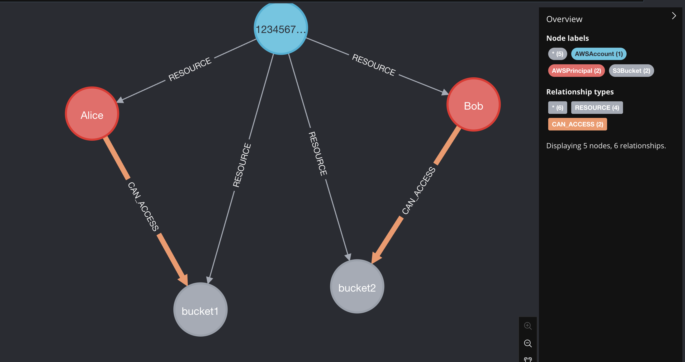

# MatchLinks

MatchLinks are a way to create relationships between two existing nodes in the graph.

## Example

Suppose we have a graph that has AWSPrincipals and S3Buckets. We want to create a relationship between an AWSPrincipal and an S3Bucket if the AWSPrincipal has access to the S3Bucket.

Let's say we have the following data that maps principals with the S3Buckets they can read from:

1. Define the mapping data
    ```python
    mapping_data = [
        {
            "principal_arn": "arn:aws:iam::123456789012:role/Alice",
            "bucket_name": "bucket1",
            "permission_action": "s3:GetObject",
        },
        {
            "principal_arn": "arn:aws:iam::123456789012:role/Bob",
            "bucket_name": "bucket2",
            "permission_action": "s3:GetObject",
        }
    ]
    ```

1. Define the MatchLink relationship between the AWSPrincipal and the S3Bucket
    ```python
    from cartography.models.core.relationships import (
        CartographyRelProperties,
        CartographyRelSchema,
        LinkDirection,
        SourceNodeMatcher,
        TargetNodeMatcher,
    )

    @dataclass(frozen=True)
    class S3AccessMatchLink(CartographyRelSchema):
        rel_label: str = "CAN_ACCESS"
        direction: LinkDirection = LinkDirection.OUTWARD
        properties: S3AccessRelProps = S3AccessRelProps()
        target_node_label: str = "S3Bucket"
        target_node_matcher: TargetNodeMatcher = make_target_node_matcher(
            {'name': PropertyRef('bucket_name')},
        )

        # These are the additional fields that we need to define for a MatchLink
        source_node_label: str = "AWSPrincipal"
        source_node_matcher: SourceNodeMatcher = make_source_node_matcher(
            {'principal_arn': PropertyRef('principal_arn')},
        )
    ```

    This is a standard `CartographyRelSchema` object as described in the [intel module guide](writing-intel-modules#defining-relationships), **except** that now we have defined a `source_node_label` and a `source_node_matcher`.

1. Define a `CartographyRelProperties` object with some additional fields:
    ```python
    @dataclass(frozen=True)
    class S3AccessRelProps(CartographyRelProperties):
        # <Mandatory fields for MatchLinks>
        lastupdated: PropertyRef = PropertyRef("UPDATE_TAG", set_in_kwargs=True)

        # Cartography syncs objects account-by-account (or "sub-resource"-by-"sub-resource")
        # We store the sub-resource label and id on the relationship itself so that we can
        # clean up stale relationships without deleting relationships defined in other accounts.
        _sub_resource_label: PropertyRef = PropertyRef("_sub_resource_label", set_in_kwargs=True)
        _sub_resource_id: PropertyRef = PropertyRef("_sub_resource_id", set_in_kwargs=True)
        # </Mandatory fields for MatchLinks>

        # Add in extra properties that we want to define for the relationship
        # For example, we can add a `permission_action` property to the relationship to track the action that the principal has on the bucket, e.g. 's3:GetObject'
        permission_action: PropertyRef = PropertyRef("permission_action")
    ```

1. Load the matchlinks to the graph
    ```python
    load_matchlinks(
        neo4j_session,
        S3AccessMatchLink(),
        mapping_data,
        UPDATE_TAG=UPDATE_TAG,
        _sub_resource_label="AWSAccount",
        _sub_resource_id=ACCOUNT_ID,
    )
    ```
    This function automatically creates indexes for the nodes involved, as well for the relationship between
    them (specifically, on the update tag, the sub-resource label, and the sub-resource id fields).

1. Run the cleanup to remove stale matchlinks
    ```python
    cleanup_job = GraphJob.from_matchlink(matchlink, "AWSAccount", ACCOUNT_ID, UPDATE_TAG)
    cleanup_job.run(neo4j_session)
    ```

1. Enjoy!
    


A fully working (non-production!) test example is here:

```python
from dataclasses import dataclass
import time

from neo4j import GraphDatabase
from cartography.client.core.tx import load_matchlinks
from cartography.graph.job import GraphJob
from cartography.models.core.common import PropertyRef
from cartography.models.core.relationships import (
        CartographyRelProperties,
        CartographyRelSchema,
        LinkDirection,
        SourceNodeMatcher,
        TargetNodeMatcher,
        make_source_node_matcher,
        make_target_node_matcher,
    )


@dataclass(frozen=True)
class S3AccessRelProps(CartographyRelProperties):
    # <Mandatory fields for MatchLinks>
    lastupdated: PropertyRef = PropertyRef("UPDATE_TAG", set_in_kwargs=True)

    # Cartography syncs objects account-by-account (or "sub-resource"-by-"sub-resource")
    # We store the sub-resource label and id on the relationship itself so that we can
    # clean up stale relationships without deleting relationships defined in other accounts.
    _sub_resource_label: PropertyRef = PropertyRef("_sub_resource_label", set_in_kwargs=True)
    _sub_resource_id: PropertyRef = PropertyRef("_sub_resource_id", set_in_kwargs=True)
    # </Mandatory fields for MatchLinks>

    # Add in extra properties that we want to define for the relationship
    # For example, we can add a `permission_action` property to the relationship to track the action that the principal has on the bucket, e.g. 's3:GetObject'
    permission_action: PropertyRef = PropertyRef("permission_action")

@dataclass(frozen=True)
class S3AccessMatchLink(CartographyRelSchema):
    rel_label: str = "CAN_ACCESS"
    direction: LinkDirection = LinkDirection.OUTWARD
    properties: S3AccessRelProps = S3AccessRelProps()
    target_node_label: str = "S3Bucket"
    target_node_matcher: TargetNodeMatcher = make_target_node_matcher(
        {'name': PropertyRef('bucket_name')},
    )

    # These are the additional fields that we need to define for a MatchLink
    source_node_label: str = "AWSPrincipal"
    source_node_matcher: SourceNodeMatcher = make_source_node_matcher(
        {'principal_arn': PropertyRef('principal_arn')},
    )

mapping_data = [
    {
        "principal_arn": "arn:aws:iam::123456789012:role/Alice",
        "bucket_name": "bucket1",
        "permission_action": "s3:GetObject",
    },
    {
        "principal_arn": "arn:aws:iam::123456789012:role/Bob",
        "bucket_name": "bucket2",
        "permission_action": "s3:GetObject",
    }
]


if __name__ == "__main__":
    UPDATE_TAG = int(time.time())
    ACCOUNT_ID = "123456789012"

    driver = GraphDatabase.driver("bolt://localhost:7687", auth=None)
    with driver.session() as neo4j_session:
        neo4j_session.run("MATCH (n) DETACH DELETE n")

        # Account 123456789012 has principals p1 and p2, and buckets b1, b2, b3.
        neo4j_session.run("""
        MERGE (acc:AWSAccount {id: $account_id, lastupdated: $update_tag})
        MERGE (p1:AWSPrincipal {principal_arn: "arn:aws:iam::123456789012:role/Alice", name:"Alice", lastupdated: $update_tag})
        MERGE (acc)-[res1:RESOURCE]->(p1)

        MERGE (p2:AWSPrincipal {principal_arn: "arn:aws:iam::123456789012:role/Bob", name:"Bob", lastupdated: $update_tag})
        MERGE (acc)-[res2:RESOURCE]->(p2)

        MERGE (b1:S3Bucket {name: "bucket1", lastupdated: $update_tag})
        MERGE (acc)-[res3:RESOURCE]->(b1)

        MERGE (b2:S3Bucket {name: "bucket2", lastupdated: $update_tag})
        MERGE (acc)-[res4:RESOURCE]->(b2)
        SET res1.lastupdated = $update_tag, res2.lastupdated = $update_tag, res3.lastupdated = $update_tag, res4.lastupdated = $update_tag
        """, update_tag=UPDATE_TAG, account_id=ACCOUNT_ID)

        load_matchlinks(
            neo4j_session,
            S3AccessMatchLink(),
            mapping_data,
            UPDATE_TAG=UPDATE_TAG,
            _sub_resource_label="AWSAccount",
            _sub_resource_id=ACCOUNT_ID,
        )
        cleanup_job = GraphJob.from_matchlink(S3AccessMatchLink(), "AWSAccount", ACCOUNT_ID, UPDATE_TAG)
        cleanup_job.run(neo4j_session)
```
