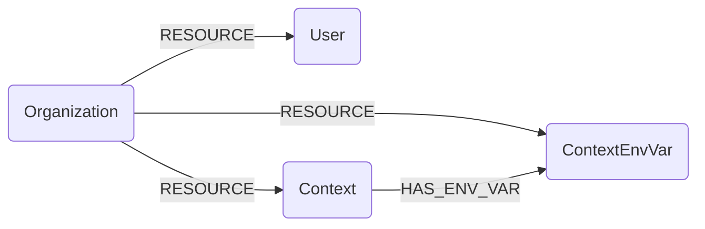

## CircleCI Schema



### CircleCIOrganization

Represents a CircleCI organization (a VCS org the token owner collaborates with), from `GET /me/collaborations`.

> **Ontology Mapping**: This node has the extra label `Tenant` to enable cross-platform queries for organizational tenants across different systems (e.g., OktaOrganization, AzureTenant, GCPOrganization).

| Field | Description |
|-------|-------------|
| **id** | Organization ID. |
| firstseen | Timestamp of when a sync job first created this node. |
| lastupdated | Timestamp of the last time the node was updated. |
| name | Organization display name. |
| **slug** | Organization slug (e.g. `gh/my-org`). |
| vcs_type | Version control system (`github`, `bitbucket`, ...). |
| avatar_url | URL of the organization avatar. |

### CircleCIUser

Represents the owner of the API token used for the sync (`GET /me`).

| Field | Description |
|-------|-------------|
| **id** | User ID. |
| firstseen | Timestamp of when a sync job first created this node. |
| lastupdated | Timestamp of the last time the node was updated. |
| **login** | User login/handle. |
| name | User display name. |
| avatar_url | URL of the user avatar. |

#### Relationships
- A user collaborates with an organization.
    ```
    (:CircleCIOrganization)-[:RESOURCE]->(:CircleCIUser)
    ```

### CircleCIContext

Represents a CircleCI context, a named bundle of shared environment variables/secrets available to projects in the organization.

| Field | Description |
|-------|-------------|
| **id** | Context ID. |
| firstseen | Timestamp of when a sync job first created this node. |
| lastupdated | Timestamp of the last time the node was updated. |
| **name** | Context name. |
| created_at | Context creation timestamp. |

#### Relationships
- A context belongs to an organization.
    ```
    (:CircleCIOrganization)-[:RESOURCE]->(:CircleCIContext)
    ```

### CircleCIContextEnvVar

Represents an environment variable defined within a context. Only the variable **name** and metadata are stored; CircleCI never exposes the value.

| Field | Description |
|-------|-------------|
| **id** | Synthesized id, `{context_id}:{variable}`. |
| firstseen | Timestamp of when a sync job first created this node. |
| lastupdated | Timestamp of the last time the node was updated. |
| **variable** | Environment variable name. |
| context_id | ID of the owning context. |
| created_at | Variable creation timestamp. |
| updated_at | Variable last-update timestamp. |

#### Relationships
- A context environment variable belongs to an organization and to a context.
    ```
    (:CircleCIOrganization)-[:RESOURCE]->(:CircleCIContextEnvVar)
    (:CircleCIContext)-[:HAS_ENV_VAR]->(:CircleCIContextEnvVar)
    ```
