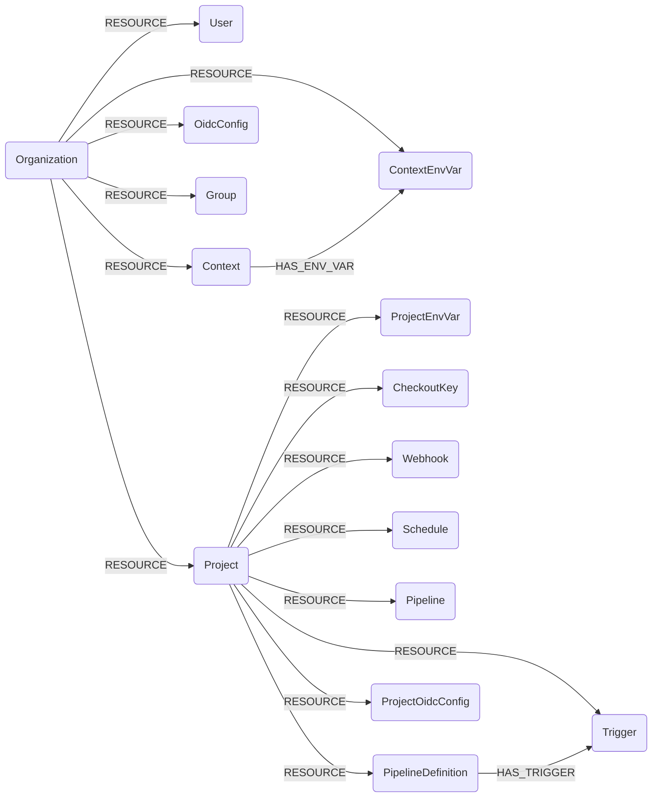

## CircleCI Schema



Project-scoped nodes (Project and everything below it) are only synced for the project slugs passed via `--circleci-project-slugs`; CircleCI API v2 cannot enumerate an organization's projects.

### CircleCIOrganization

Represents a CircleCI organization (a VCS org the token owner collaborates with), from `GET /me/collaborations`.

> **Ontology Mapping**: This node has the extra label `Tenant` to enable cross-platform queries for organizational tenants across different systems (e.g., OktaOrganization, AzureTenant, GCPOrganization).

| Field | Description |
|-------|-------------|
| **id** | Organization ID. |
| firstseen | Timestamp of when a sync job first created this node. |
| lastupdated | Timestamp of the last time the node was updated. |
| name | Organization display name. |
| **slug** | Organization slug (e.g. `gh/my-org`). |
| vcs_type | Version control system (`github`, `bitbucket`, ...). |
| avatar_url | URL of the organization avatar. |

### CircleCIUser

Represents the owner of the API token used for the sync (`GET /me`).

| Field | Description |
|-------|-------------|
| **id** | User ID. |
| firstseen | Timestamp of when a sync job first created this node. |
| lastupdated | Timestamp of the last time the node was updated. |
| **login** | User login/handle. |
| name | User display name. |
| avatar_url | URL of the user avatar. |

#### Relationships
- A user collaborates with an organization.
    ```
    (:CircleCIOrganization)-[:RESOURCE]->(:CircleCIUser)
    ```

### CircleCIContext

Represents a CircleCI context, a named bundle of shared environment variables/secrets available to projects in the organization.

| Field | Description |
|-------|-------------|
| **id** | Context ID. |
| firstseen | Timestamp of when a sync job first created this node. |
| lastupdated | Timestamp of the last time the node was updated. |
| **name** | Context name. |
| created_at | Context creation timestamp. |

#### Relationships
- A context belongs to an organization.
    ```
    (:CircleCIOrganization)-[:RESOURCE]->(:CircleCIContext)
    ```

### CircleCIContextEnvVar

Represents an environment variable defined within a context. Only the variable **name** and metadata are stored; CircleCI never exposes the value.

| Field | Description |
|-------|-------------|
| **id** | Synthesized id, `{context_id}:{variable}`. |
| firstseen | Timestamp of when a sync job first created this node. |
| lastupdated | Timestamp of the last time the node was updated. |
| **variable** | Environment variable name. |
| context_id | ID of the owning context. |
| created_at | Variable creation timestamp. |
| updated_at | Variable last-update timestamp. |

#### Relationships
- A context environment variable belongs to an organization and to a context.
    ```
    (:CircleCIOrganization)-[:RESOURCE]->(:CircleCIContextEnvVar)
    (:CircleCIContext)-[:HAS_ENV_VAR]->(:CircleCIContextEnvVar)
    ```

### CircleCIOidcConfig

Represents an organization's OIDC custom-claims configuration (`GET /org/{orgID}/oidc-custom-claims`). The `audience` list shows which cloud audiences trust CircleCI's OIDC tokens.

| Field | Description |
|-------|-------------|
| **id** | The organization ID (one org-level config per org). |
| firstseen | Timestamp of when a sync job first created this node. |
| lastupdated | Timestamp of the last time the node was updated. |
| scope | `organization` (project-level claims are not yet synced). |
| audience | List of trusted OIDC audiences. |
| audience_updated_at | When the audience was last changed. |
| ttl | Token time-to-live. |
| ttl_updated_at | When the TTL was last changed. |
| org_id | Owning organization ID. |
| project_id | Owning project ID (null for org-level). |

#### Relationships
- An OIDC config belongs to an organization.
    ```
    (:CircleCIOrganization)-[:RESOURCE]->(:CircleCIOidcConfig)
    ```

### CircleCIGroup

Represents an organization group (`GET /organizations/{org_id}/groups`).

| Field | Description |
|-------|-------------|
| **id** | Group ID. |
| firstseen | Timestamp of when a sync job first created this node. |
| lastupdated | Timestamp of the last time the node was updated. |
| **name** | Group name. |
| description | Group description. |

#### Relationships
- A group belongs to an organization.
    ```
    (:CircleCIOrganization)-[:RESOURCE]->(:CircleCIGroup)
    ```

### CircleCIProject

Represents a CircleCI project (`GET /project/{project-slug}`). Only synced for slugs passed via `--circleci-project-slugs`.

| Field | Description |
|-------|-------------|
| **id** | Opaque project ID. |
| firstseen | Timestamp of when a sync job first created this node. |
| lastupdated | Timestamp of the last time the node was updated. |
| **slug** | Project slug (e.g. `gh/acme/web`). |
| name | Project (repository) name. |
| organization_name | Owning organization name. |
| organization_slug | Owning organization slug. |
| organization_id | Owning organization ID. |
| vcs_url | Repository URL. |
| vcs_provider | VCS provider (e.g. `GitHub`). |
| default_branch | Default branch name. |

#### Relationships
- A project belongs to an organization.
    ```
    (:CircleCIOrganization)-[:RESOURCE]->(:CircleCIProject)
    ```

### CircleCIProjectEnvVar

Represents a project-level environment variable. Only the **name** is stored; CircleCI returns a masked value.

| Field | Description |
|-------|-------------|
| **id** | Synthesized id, `{project_slug}:{name}`. |
| firstseen | Timestamp of when a sync job first created this node. |
| lastupdated | Timestamp of the last time the node was updated. |
| **name** | Environment variable name. |
| project_slug | Slug of the owning project. |
| value | Masked value (`xxxx` + last 4 chars); the real secret is never exposed by the API. |

#### Relationships
- A project environment variable belongs to a project.
    ```
    (:CircleCIProject)-[:RESOURCE]->(:CircleCIProjectEnvVar)
    ```

### CircleCICheckoutKey

Represents a project checkout/deploy key (`GET /project/{slug}/checkout-key`). Only the public key is stored.

| Field | Description |
|-------|-------------|
| **id** | Synthesized id, `{project_slug}:{fingerprint}`. |
| firstseen | Timestamp of when a sync job first created this node. |
| lastupdated | Timestamp of the last time the node was updated. |
| **fingerprint** | Key fingerprint. |
| type | Key type (`deploy-key`, `github-user-key`, ...). |
| preferred | Whether this is the preferred key. |
| public_key | The SSH public key. |
| created_at | Key creation timestamp. |
| project_slug | Slug of the owning project. |

#### Relationships
- A checkout key belongs to a project.
    ```
    (:CircleCIProject)-[:RESOURCE]->(:CircleCICheckoutKey)
    ```

### CircleCIWebhook

Represents an outbound webhook scoped to a project (`GET /webhook`).

| Field | Description |
|-------|-------------|
| **id** | Webhook ID. |
| firstseen | Timestamp of when a sync job first created this node. |
| lastupdated | Timestamp of the last time the node was updated. |
| **name** | Webhook name. |
| url | Destination URL. |
| verify_tls | Whether TLS verification is enabled. |
| has_signing_secret | Whether a signing secret is configured (the value itself is never stored). |
| events | List of subscribed event types. |

#### Relationships
- A webhook belongs to a project.
    ```
    (:CircleCIProject)-[:RESOURCE]->(:CircleCIWebhook)
    ```

### CircleCISchedule

Represents a scheduled pipeline trigger (`GET /project/{slug}/schedule`).

| Field | Description |
|-------|-------------|
| **id** | Schedule ID. |
| firstseen | Timestamp of when a sync job first created this node. |
| lastupdated | Timestamp of the last time the node was updated. |
| **name** | Schedule name. |
| description | Schedule description. |
| project_slug | Slug of the owning project. |
| actor_login | Login of the actor the schedule runs as. |

#### Relationships
- A schedule belongs to a project.
    ```
    (:CircleCIProject)-[:RESOURCE]->(:CircleCISchedule)
    ```

### CircleCIPipeline

Represents a pipeline run (`GET /project/{slug}/pipeline`). Pagination is capped to bound graph size.

| Field | Description |
|-------|-------------|
| **id** | Pipeline ID. |
| firstseen | Timestamp of when a sync job first created this node. |
| lastupdated | Timestamp of the last time the node was updated. |
| number | Pipeline number. |
| state | Pipeline state. |
| project_slug | Slug of the owning project. |
| trigger_type | What triggered the pipeline (`webhook`, `schedule`, `api`, ...). |
| created_at | Pipeline creation timestamp. |
| updated_at | Pipeline last-update timestamp. |

#### Relationships
- A pipeline belongs to a project.
    ```
    (:CircleCIProject)-[:RESOURCE]->(:CircleCIPipeline)
    ```

### CircleCIPipelineDefinition

Represents a pipeline definition (the config/source binding, `GET /projects/{project_id}/pipeline-definitions`). Distinct from a pipeline run.

| Field | Description |
|-------|-------------|
| **id** | Pipeline definition ID. |
| firstseen | Timestamp of when a sync job first created this node. |
| lastupdated | Timestamp of the last time the node was updated. |
| **name** | Definition name. |
| description | Definition description. |
| created_at | Creation timestamp. |
| config_source_provider | Provider of the config source (e.g. `github_app`). |
| config_source_repo | Repository holding the config. |
| config_source_file_path | Path to the config file. |
| checkout_source_provider | Provider of the checkout source. |
| checkout_source_repo | Repository checked out. |

#### Relationships
- A pipeline definition belongs to a project.
    ```
    (:CircleCIProject)-[:RESOURCE]->(:CircleCIPipelineDefinition)
    ```

### CircleCITrigger

Represents a trigger attached to a pipeline definition (`GET /projects/{id}/pipeline-definitions/{def_id}/triggers`).

| Field | Description |
|-------|-------------|
| **id** | Trigger ID. |
| firstseen | Timestamp of when a sync job first created this node. |
| lastupdated | Timestamp of the last time the node was updated. |
| **event_name** | Event the trigger fires on (e.g. `push`). |
| event_preset | Event preset. |
| event_source_provider | Provider of the event source. |
| checkout_ref | Ref to check out. |
| config_ref | Ref to read config from. |
| disabled | Whether the trigger is disabled. |
| pipeline_definition_id | ID of the owning pipeline definition. |

#### Relationships
- A trigger belongs to a project and to a pipeline definition.
    ```
    (:CircleCIProject)-[:RESOURCE]->(:CircleCITrigger)
    (:CircleCIPipelineDefinition)-[:HAS_TRIGGER]->(:CircleCITrigger)
    ```

### CircleCIProjectOidcConfig

Represents a project's OIDC custom-claims configuration (`GET /org/{orgID}/project/{projectID}/oidc-custom-claims`). Same shape as the org-level config, scoped to a project.

| Field | Description |
|-------|-------------|
| **id** | The project ID (one project-level config per project). |
| firstseen | Timestamp of when a sync job first created this node. |
| lastupdated | Timestamp of the last time the node was updated. |
| scope | `project`. |
| audience | List of trusted OIDC audiences. |
| audience_updated_at | When the audience was last changed. |
| ttl | Token time-to-live. |
| ttl_updated_at | When the TTL was last changed. |
| org_id | Owning organization ID. |
| project_id | Owning project ID. |

#### Relationships
- A project OIDC config belongs to a project.
    ```
    (:CircleCIProject)-[:RESOURCE]->(:CircleCIProjectOidcConfig)
    ```
