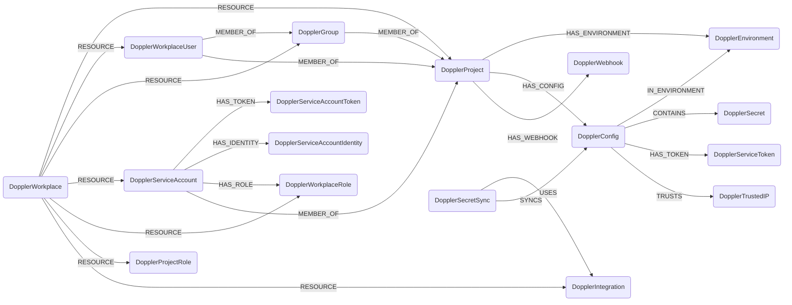

## Doppler Schema



### DopplerWorkplace

Represents a Doppler [workplace](https://docs.doppler.com/reference/workplace-get), the tenant root.

> **Ontology Mapping**: This node has the extra label `Tenant` to enable cross-platform queries for organizational tenants across different systems.

| Field | Description |
|-------|-------------|
| id | The workplace identifier |
| name | The workplace name |
| billing_email | Billing contact email |
| security_email | Security contact email |
| firstseen | Timestamp of when a sync job first created this node |
| lastupdated | Timestamp of the last time the node was updated |

#### Relationships
- Resources belong to a `DopplerWorkplace`
    ```
    (DopplerWorkplace)-[:RESOURCE]->(
        :DopplerProject,
        :DopplerWorkplaceUser,
        :DopplerGroup,
        :DopplerServiceAccount,
        :DopplerServiceAccountToken,
        :DopplerServiceAccountIdentity,
        :DopplerWorkplaceRole,
        :DopplerProjectRole,
        :DopplerEnvironment,
        :DopplerConfig,
        :DopplerSecret,
        :DopplerServiceToken,
        :DopplerTrustedIP,
        :DopplerIntegration,
        :DopplerSecretSync,
        :DopplerWebhook)
    ```

### DopplerProject

Represents a Doppler [project](https://docs.doppler.com/reference/projects-list).

| Field | Description |
|-------|-------------|
| id | The project identifier |
| slug | URL-friendly project name |
| name | Display name |
| description | Project description |
| created_at | Creation timestamp |
| firstseen | Timestamp of when a sync job first created this node |
| lastupdated | Timestamp of the last time the node was updated |

#### Relationships
- A `DopplerProject` belongs to a workplace and contains environments, configs and webhooks.
    ```
    (DopplerWorkplace)-[:RESOURCE]->(DopplerProject)
    (DopplerProject)-[:HAS_ENVIRONMENT]->(DopplerEnvironment)
    (DopplerProject)-[:HAS_CONFIG]->(DopplerConfig)
    (DopplerProject)-[:HAS_WEBHOOK]->(DopplerWebhook)
    ```
- Workplace users, groups and service accounts are members of projects (with the project role on the edge).
    ```
    (:DopplerWorkplaceUser)-[:MEMBER_OF]->(:DopplerProject)
    (:DopplerGroup)-[:MEMBER_OF]->(:DopplerProject)
    (:DopplerServiceAccount)-[:MEMBER_OF]->(:DopplerProject)
    ```

### DopplerEnvironment

Represents a Doppler [environment](https://docs.doppler.com/reference/environments-list) within a project.

| Field | Description |
|-------|-------------|
| id | Composite `{project}/{env_id}` identifier |
| env_id | The per-project environment slug (e.g. `dev`) |
| name | Display name |
| project | Owning project slug |
| created_at | Creation timestamp |
| initial_fetch_at | First fetch timestamp (nullable) |
| firstseen | Timestamp of when a sync job first created this node |
| lastupdated | Timestamp of the last time the node was updated |

#### Relationships
    ```
    (DopplerProject)-[:HAS_ENVIRONMENT]->(DopplerEnvironment)
    (DopplerConfig)-[:IN_ENVIRONMENT]->(DopplerEnvironment)
    ```

### DopplerConfig

Represents a Doppler [config](https://docs.doppler.com/reference/configs-list).

| Field | Description |
|-------|-------------|
| id | Composite `{project}/{name}` identifier |
| name | Config name |
| project | Owning project slug |
| environment | Environment slug |
| root | Whether this is a root config |
| locked | Whether the config is locked |
| created_at | Creation timestamp |
| firstseen | Timestamp of when a sync job first created this node |
| lastupdated | Timestamp of the last time the node was updated |

#### Relationships
    ```
    (DopplerProject)-[:HAS_CONFIG]->(DopplerConfig)
    (DopplerConfig)-[:IN_ENVIRONMENT]->(DopplerEnvironment)
    (DopplerConfig)-[:CONTAINS]->(DopplerSecret)
    (DopplerConfig)-[:HAS_TOKEN]->(DopplerServiceToken)
    (DopplerConfig)-[:TRUSTS]->(DopplerTrustedIP)
    (DopplerSecretSync)-[:SYNCS]->(DopplerConfig)
    ```

### DopplerSecret

Represents the *name* of a Doppler [secret](https://docs.doppler.com/reference/secrets-list). **Secret values (raw/computed) are never ingested.**

> **Ontology Mapping**: This node has the extra label `Secret`.

| Field | Description |
|-------|-------------|
| id | Composite `{project}/{config}/{name}` identifier |
| name | The secret name (key) |
| project | Owning project slug |
| config | Owning config name |
| firstseen | Timestamp of when a sync job first created this node |
| lastupdated | Timestamp of the last time the node was updated |

#### Relationships
    ```
    (DopplerConfig)-[:CONTAINS]->(DopplerSecret)
    ```

### DopplerServiceToken

Represents a config-scoped [service token](https://docs.doppler.com/reference/service_tokens-list) that can read a config's secrets.

| Field | Description |
|-------|-------------|
| id | The token slug |
| name | Token name |
| project | Owning project slug |
| environment | Environment slug |
| config | Owning config name |
| created_at | Creation timestamp |
| expires_at | Expiration timestamp (nullable) |
| firstseen | Timestamp of when a sync job first created this node |
| lastupdated | Timestamp of the last time the node was updated |

#### Relationships
    ```
    (DopplerConfig)-[:HAS_TOKEN]->(DopplerServiceToken)
    ```

### DopplerTrustedIP

Represents an IP/CIDR entry in a config's [trusted IPs](https://docs.doppler.com/reference/configs-list_trusted_ips) allowlist.

| Field | Description |
|-------|-------------|
| id | Composite `{project}/{config}/{cidr}` identifier |
| cidr | The trusted IP address or CIDR range |
| firstseen | Timestamp of when a sync job first created this node |
| lastupdated | Timestamp of the last time the node was updated |

#### Relationships
    ```
    (DopplerConfig)-[:TRUSTS]->(DopplerTrustedIP)
    ```

### DopplerWorkplaceUser

Represents a [member](https://docs.doppler.com/reference/users-list) of a workplace.

> **Ontology Mapping**: This node has the extra label `UserAccount` to enable cross-platform queries for user accounts across different systems.

| Field | Description |
|-------|-------------|
| id | The workplace user identifier |
| access | Access level (e.g. `owner`, `collaborator`) |
| email | User email |
| name | User full name |
| username | Username handle |
| profile_image_url | Avatar URL |
| created_at | When the user was added |
| firstseen | Timestamp of when a sync job first created this node |
| lastupdated | Timestamp of the last time the node was updated |

#### Relationships
    ```
    (DopplerWorkplace)-[:RESOURCE]->(DopplerWorkplaceUser)
    (DopplerWorkplaceUser)-[:MEMBER_OF]->(DopplerGroup)
    (DopplerWorkplaceUser)-[:MEMBER_OF]->(DopplerProject)
    ```

### DopplerGroup

Represents a workplace [group](https://docs.doppler.com/reference/groups-list).

| Field | Description |
|-------|-------------|
| id | The group slug |
| name | Group name |
| created_at | Creation timestamp |
| default_project_role | Default project role identifier for members |
| firstseen | Timestamp of when a sync job first created this node |
| lastupdated | Timestamp of the last time the node was updated |

#### Relationships
    ```
    (DopplerWorkplace)-[:RESOURCE]->(DopplerGroup)
    (DopplerWorkplaceUser)-[:MEMBER_OF]->(DopplerGroup)
    (DopplerGroup)-[:MEMBER_OF]->(DopplerProject)
    ```

### DopplerServiceAccount

Represents a workplace [service account](https://docs.doppler.com/reference/service_accounts-list) (machine identity).

| Field | Description |
|-------|-------------|
| id | The service account slug |
| name | Service account name |
| created_at | Creation timestamp |
| firstseen | Timestamp of when a sync job first created this node |
| lastupdated | Timestamp of the last time the node was updated |

#### Relationships
    ```
    (DopplerWorkplace)-[:RESOURCE]->(DopplerServiceAccount)
    (DopplerServiceAccount)-[:HAS_ROLE]->(DopplerWorkplaceRole)
    (DopplerServiceAccount)-[:HAS_TOKEN]->(DopplerServiceAccountToken)
    (DopplerServiceAccount)-[:HAS_IDENTITY]->(DopplerServiceAccountIdentity)
    (DopplerServiceAccount)-[:MEMBER_OF]->(DopplerProject)
    ```

### DopplerServiceAccountToken

Represents an API [token](https://docs.doppler.com/reference/service_account_tokens-list) belonging to a service account.

| Field | Description |
|-------|-------------|
| id | The token slug |
| name | Token name |
| created_at | Creation timestamp |
| expires_at | Expiration timestamp (nullable) |
| last_seen_at | Last usage timestamp (nullable) |
| firstseen | Timestamp of when a sync job first created this node |
| lastupdated | Timestamp of the last time the node was updated |

#### Relationships
    ```
    (DopplerServiceAccount)-[:HAS_TOKEN]->(DopplerServiceAccountToken)
    ```

### DopplerServiceAccountIdentity

Represents a federated [identity](https://docs.doppler.com/reference/list) (e.g. OIDC) attached to a service account.

| Field | Description |
|-------|-------------|
| id | The identity slug |
| name | Identity name |
| method | Authentication method |
| ttl_seconds | Token lifetime |
| created_at | Creation timestamp |
| last_seen_at | Last usage timestamp (nullable) |
| firstseen | Timestamp of when a sync job first created this node |
| lastupdated | Timestamp of the last time the node was updated |

#### Relationships
    ```
    (DopplerServiceAccount)-[:HAS_IDENTITY]->(DopplerServiceAccountIdentity)
    ```

### DopplerWorkplaceRole

Represents a workplace-level [role](https://docs.doppler.com/reference/workplace_roles-list).

| Field | Description |
|-------|-------------|
| id | The role identifier |
| name | Role name |
| permissions | List of permission strings |
| is_custom_role | Whether the role is custom |
| is_inline_role | Whether the role is inline |
| created_at | Creation timestamp |
| firstseen | Timestamp of when a sync job first created this node |
| lastupdated | Timestamp of the last time the node was updated |

#### Relationships
    ```
    (DopplerWorkplace)-[:RESOURCE]->(DopplerWorkplaceRole)
    (DopplerServiceAccount)-[:HAS_ROLE]->(DopplerWorkplaceRole)
    ```

### DopplerProjectRole

Represents a project-level [role](https://docs.doppler.com/reference/project_roles-list).

| Field | Description |
|-------|-------------|
| id | The role identifier |
| name | Role name |
| permissions | List of permission strings |
| is_custom_role | Whether the role is custom |
| created_at | Creation timestamp |
| firstseen | Timestamp of when a sync job first created this node |
| lastupdated | Timestamp of the last time the node was updated |

#### Relationships
    ```
    (DopplerWorkplace)-[:RESOURCE]->(DopplerProjectRole)
    ```

### DopplerIntegration

Represents a Doppler [integration](https://docs.doppler.com/reference/integrations-list).

| Field | Description |
|-------|-------------|
| id | The integration slug |
| name | Integration name |
| type | Integration service type (e.g. `aws_secrets_manager`) |
| kind | `sync` or `rotatedSecrets` |
| enabled | Whether the integration is enabled |
| firstseen | Timestamp of when a sync job first created this node |
| lastupdated | Timestamp of the last time the node was updated |

#### Relationships
    ```
    (DopplerWorkplace)-[:RESOURCE]->(DopplerIntegration)
    (DopplerSecretSync)-[:USES]->(DopplerIntegration)
    ```

### DopplerSecretSync

Represents a secret sync that pushes a config's secrets to an integration.

| Field | Description |
|-------|-------------|
| id | The sync slug |
| enabled | Whether the sync is enabled |
| last_synced_at | Last successful sync timestamp |
| firstseen | Timestamp of when a sync job first created this node |
| lastupdated | Timestamp of the last time the node was updated |

#### Relationships
    ```
    (DopplerWorkplace)-[:RESOURCE]->(DopplerSecretSync)
    (DopplerSecretSync)-[:USES]->(DopplerIntegration)
    (DopplerSecretSync)-[:SYNCS]->(DopplerConfig)
    ```

### DopplerWebhook

Represents a project [webhook](https://docs.doppler.com/reference/webhooks-list). **The webhook secret is never ingested.**

| Field | Description |
|-------|-------------|
| id | The webhook identifier |
| name | Webhook name |
| url | Webhook URL |
| enabled | Whether the webhook is enabled |
| firstseen | Timestamp of when a sync job first created this node |
| lastupdated | Timestamp of the last time the node was updated |

#### Relationships
    ```
    (DopplerProject)-[:HAS_WEBHOOK]->(DopplerWebhook)
    ```
