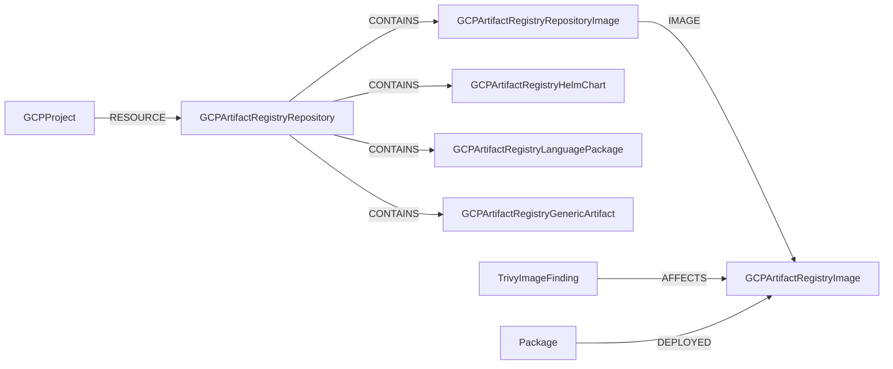

# Artifact Registry

Google Cloud Artifact Registry manages container images and language packages.
Cartography models repositories, repository-scoped image references,
digest-scoped images, image layers, Helm charts, language packages, and generic
artifacts.



Tagged DockerImage API records are expanded into one
`GCPArtifactRegistryRepositoryImage` node per tag. These nodes preserve the
repository-scoped, pullable image identity. Each repository-image node resolves
through `IMAGE` to digest-scoped `GCPArtifactRegistryImage` content, so multiple
tags, repositories, or projects may resolve to the same immutable image node.

OCI image layers are modeled independently by uncompressed diff ID. The current
model does not create a relationship between an image and its layer nodes.

## Trivy integration queries

Find all vulnerabilities affecting Artifact Registry container images:

```cypher
MATCH (vuln:TrivyImageFinding)-[:AFFECTS]->(img:GCPArtifactRegistryImage)<-[:IMAGE]-(repo_img:GCPArtifactRegistryRepositoryImage)
RETURN vuln.name, vuln.severity, repo_img.uri, img.digest
ORDER BY vuln.severity DESC
```

Find packages deployed in Artifact Registry images with their vulnerabilities:

```cypher
MATCH (pkg:Package)-[:DEPLOYED]->(img:GCPArtifactRegistryImage)<-[:IMAGE]-(repo_img:GCPArtifactRegistryRepositoryImage)
OPTIONAL MATCH (vuln:TrivyImageFinding)-[:AFFECTS]->(pkg)
RETURN repo_img.uri, pkg.name, pkg.installed_version, collect(vuln.name) AS vulnerabilities
```

Find critical vulnerabilities in Artifact Registry images with available fixes:

```cypher
MATCH (vuln:TrivyImageFinding {severity: 'CRITICAL'})-[:AFFECTS]->(img:GCPArtifactRegistryImage)<-[:IMAGE]-(repo_img:GCPArtifactRegistryRepositoryImage)
MATCH (vuln)-[:AFFECTS]->(pkg:Package)
OPTIONAL MATCH (pkg)-[:SHOULD_UPDATE_TO]->(fix:TrivyFix)
RETURN vuln.name, repo_img.uri, pkg.name, pkg.installed_version, fix.version AS fixed_version
```
