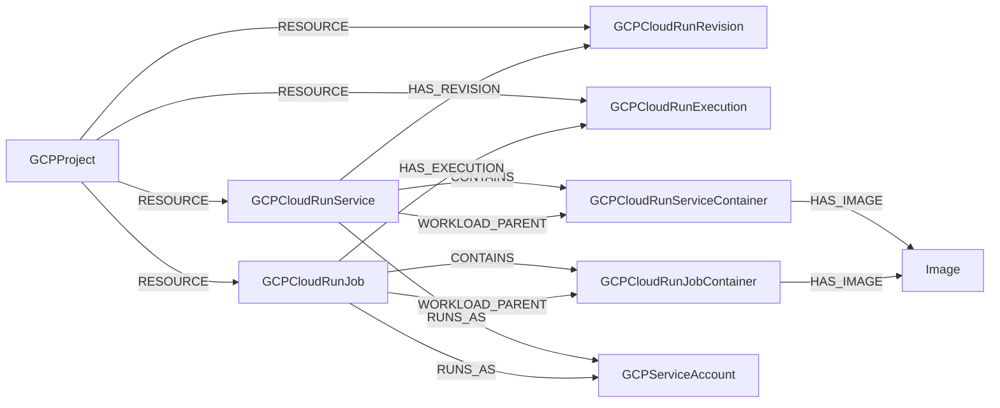

# Cloud Run

Google Cloud Run is a serverless compute platform for running containers.
Cartography models services, revisions, jobs, executions, and the container
specifications used by services and jobs. Service and job containers carry the
cross-provider `Container` label and link to resolved images.

Cloud Run services are modeled as compute services. Container specifications
from each service's latest ready revision are materialized as child service
container nodes. Older revisions remain version metadata and do not duplicate
container image data.

Cloud Run jobs are grouping nodes. Their image reference, digest, architecture,
and container ontology data live on child job container nodes.

`WORKLOAD_PARENT` is the canonical parent edge for both container types.
`CONTAINS` is retained as a deprecated compatibility edge until v1.0.0.
`HAS_IMAGE` links containers to the concrete registry image type resolved from
their image reference, including Artifact Registry, ECR, GitHub Container
Registry, and GitLab Container Registry images.
