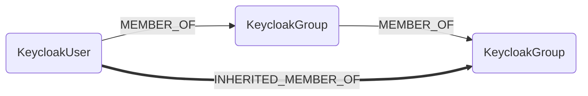
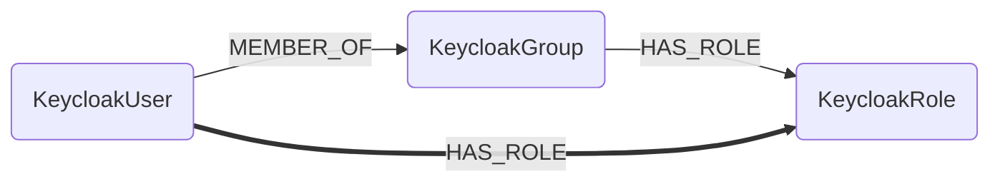
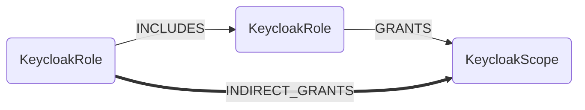
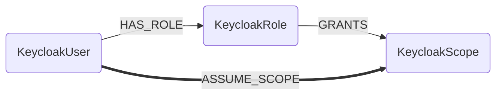
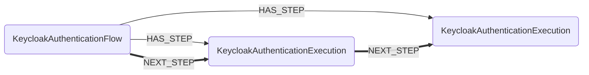

## Keycloak Built-In Analysis

Cartography computes inheritance and derived permissions after synchronizing all
Keycloak realms. Each analysis is scoped to one realm. The implementation lives
in `cartography/intel/keycloak/inheritance.py`.

### Group membership inheritance

Users inherit membership in parent groups up to five levels above a directly
assigned group. Both the canonical `MEMBER_OF` edge and the deprecated
`SUBGROUP_OF` compatibility edge are followed.

The computed `INHERITED_MEMBER_OF` edges are loaded and cleaned as scoped
MatchLinks.

### Group-based role assignment

Users receive roles granted to their direct or inherited groups. Cartography
creates the canonical `HAS_ROLE` edge and the deprecated `ASSUME_ROLE`
compatibility edge in parallel.

### Composite role scope propagation

A composite role indirectly grants scopes granted by roles that it includes,
up to five levels deep.

The computed `INDIRECT_GRANTS` edges are loaded and cleaned as scoped
MatchLinks.

### User scope assignment

A user can assume scopes granted by any direct or inherited role. Cartography
also grants every user in the realm an orphan scope that has no role mapping,
matching Keycloak's default scope behavior.

The computed `ASSUME_SCOPE` edges are loaded and cleaned as scoped MatchLinks.

### Authentication flow modeling

Only root flows are represented by `KeycloakAuthenticationFlow` nodes.
Keycloak subflows are represented by `KeycloakAuthenticationExecution` nodes,
with the original subflow ID retained on the execution.

Cartography uses two relationships for different views of a flow:

- `HAS_STEP` describes the composition returned by Keycloak.
- `NEXT_STEP` describes the possible execution order inferred by Cartography.

