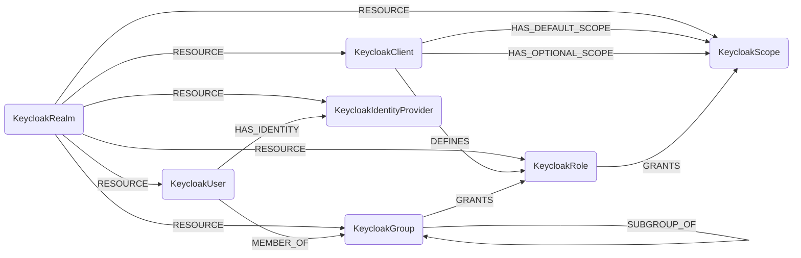

## Keycloak Schema



### KeycloakRealm

Represents a Keycloak realm, which is a security domain where users, groups, roles, and other entities are managed.

| Field | Description |
|-------|-------------|
| firstseen| Timestamp of when a sync job first created this node  |
| lastupdated |  Timestamp of the last time the node was updated |
| id | The unique identifier of the realm |
| name | The realm name (indexed for queries) |
| display_name | The display name of the realm |
| enabled | Whether the realm is enabled |
| not_before | Not before timestamp for security |
| default_signature_algorithm | Default signature algorithm for the realm |
| revoke_refresh_token | Whether refresh tokens should be revoked |
| refresh_token_max_reuse | Maximum reuse count for refresh tokens |
| access_token_lifespan | Lifespan of access tokens in seconds |
| access_token_lifespan_for_implicit_flow | Access token lifespan for implicit flow |
| sso_session_idle_timeout | SSO session idle timeout in seconds |
| sso_session_max_lifespan | Maximum SSO session lifespan in seconds |
| sso_session_idle_timeout_remember_me | SSO session idle timeout when remember me is enabled |
| sso_session_max_lifespan_remember_me | Maximum SSO session lifespan when remember me is enabled |
| offline_session_idle_timeout | Offline session idle timeout in seconds |
| offline_session_max_lifespan_enabled | Whether offline session max lifespan is enabled |
| offline_session_max_lifespan | Maximum offline session lifespan in seconds |
| client_session_idle_timeout | Client session idle timeout in seconds |
| client_session_max_lifespan | Maximum client session lifespan in seconds |
| client_offline_session_idle_timeout | Client offline session idle timeout in seconds |
| client_offline_session_max_lifespan | Maximum client offline session lifespan in seconds |
| access_code_lifespan | Access code lifespan in seconds |
| access_code_lifespan_user_action | Access code lifespan for user actions in seconds |
| access_code_lifespan_login | Access code lifespan for login in seconds |
| action_token_generated_by_admin_lifespan | Action token lifespan when generated by admin |
| action_token_generated_by_user_lifespan | Action token lifespan when generated by user |
| oauth2_device_code_lifespan | OAuth2 device code lifespan in seconds |
| oauth2_device_polling_interval | OAuth2 device polling interval in seconds |
| ssl_required | SSL requirement level for the realm |
| password_credential_grant_allowed | Whether password credential grant is allowed |
| registration_allowed | Whether user registration is allowed |
| registration_email_as_username | Whether email is used as username during registration |
| remember_me | Whether remember me functionality is enabled |
| verify_email | Whether email verification is required |
| login_with_email_allowed | Whether login with email is allowed |
| duplicate_emails_allowed | Whether duplicate emails are allowed |
| reset_password_allowed | Whether password reset is allowed |
| edit_username_allowed | Whether username editing is allowed |
| user_cache_enabled | Whether user cache is enabled |
| realm_cache_enabled | Whether realm cache is enabled |
| brute_force_protected | Whether brute force protection is enabled |
| permanent_lockout | Whether permanent lockout is enabled |
| max_temporary_lockouts | Maximum number of temporary lockouts |
| max_failure_wait_seconds | Maximum failure wait time in seconds |
| minimum_quick_login_wait_seconds | Minimum quick login wait time in seconds |
| wait_increment_seconds | Wait increment in seconds |
| quick_login_check_milli_seconds | Quick login check time in milliseconds |
| max_delta_time_seconds | Maximum delta time in seconds |
| failure_factor | Failure factor for brute force protection |
| events_enabled | Whether events are enabled |
| events_expiration | Events expiration time |
| admin_events_enabled | Whether admin events are enabled |
| admin_events_details_enabled | Whether admin event details are enabled |
| internationalization_enabled | Whether internationalization is enabled |
| default_locale | Default locale for the realm |
| password_policy | Password policy configuration |
| otp_policy_type | OTP policy type |
| otp_policy_algorithm | OTP policy algorithm |
| otp_policy_initial_counter | OTP policy initial counter |
| otp_policy_digits | Number of digits in OTP |
| otp_policy_look_ahead_window | OTP policy look ahead window |
| otp_policy_period | OTP policy period |
| otp_policy_code_reusable | Whether OTP codes are reusable |
| web_authn_policy_rp_entity_name | WebAuthn relying party entity name |
| web_authn_policy_rp_id | WebAuthn relying party ID |
| web_authn_policy_attestation_conveyance_preference | WebAuthn attestation conveyance preference |
| web_authn_policy_authenticator_attachment | WebAuthn authenticator attachment |
| web_authn_policy_require_resident_key | Whether WebAuthn requires resident key |
| web_authn_policy_user_verification_requirement | WebAuthn user verification requirement |
| web_authn_policy_create_timeout | WebAuthn create timeout |
| web_authn_policy_avoid_same_authenticator_register | Whether to avoid same authenticator registration |
| web_authn_policy_passwordless_rp_entity_name | WebAuthn passwordless relying party entity name |
| web_authn_policy_passwordless_rp_id | WebAuthn passwordless relying party ID |
| web_authn_policy_passwordless_attestation_conveyance_preference | WebAuthn passwordless attestation conveyance preference |
| web_authn_policy_passwordless_authenticator_attachment | WebAuthn passwordless authenticator attachment |
| web_authn_policy_passwordless_require_resident_key | Whether WebAuthn passwordless requires resident key |
| web_authn_policy_passwordless_user_verification_requirement | WebAuthn passwordless user verification requirement |
| web_authn_policy_passwordless_create_timeout | WebAuthn passwordless create timeout |
| web_authn_policy_passwordless_avoid_same_authenticator_register | Whether to avoid same authenticator registration for passwordless |
| keycloak_version | Version of Keycloak |
| user_managed_access_allowed | Whether user managed access is allowed |
| organizations_enabled | Whether organizations are enabled |
| verifiable_credentials_enabled | Whether verifiable credentials are enabled |
| admin_permissions_enabled | Whether admin permissions are enabled |
| social | Social login configuration |
| update_profile_on_initial_social_login | Whether to update profile on initial social login |
| o_auth2_device_code_lifespan | OAuth2 device code lifespan |
| o_auth2_device_polling_interval | OAuth2 device polling interval |
| bruteForceStrategy | Brute force protection strategy |
| default_role_id | ID of the default role |

#### Relationships
- `KeycloakRealm` is the parent container for other Keycloak entities
    ```
    (:KeycloakRealm)<-[:RESOURCE]-(
        :KeycloakClient,
        :KeycloakGroup,
        :KeycloakUser,
        :KeycloakRole,
        :KeycloakScope,
        :KeycloakIdentityProvider,
    )
    ```


### KeycloakClient

Represents a Keycloak client application that can request authentication and authorization services from the realm.

| Field | Description |
|-------|-------------|
| firstseen| Timestamp of when a sync job first created this node  |
| lastupdated |  Timestamp of the last time the node was updated |
| id | The unique identifier of the client |
| client_id | The client identifier used in protocols |
| name | The name of the client |
| description | The description of the client |
| type | The type of the client |
| root_url | The root URL of the client |
| admin_url | The admin URL of the client |
| base_url | The base URL of the client |
| surrogate_auth_required | Whether surrogate authentication is required |
| enabled | Whether the client is enabled |
| always_display_in_console | Whether to always display in console |
| client_authenticator_type | The client authenticator type |
| registration_access_token | Registration access token |
| not_before | Not before timestamp for security |
| bearer_only | Whether this is a bearer-only client |
| consent_required | Whether user consent is required |
| standard_flow_enabled | Whether standard flow is enabled |
| implicit_flow_enabled | Whether implicit flow is enabled |
| direct_access_grants_enabled | Whether direct access grants are enabled |
| service_accounts_enabled | Whether service accounts are enabled |
| authorization_services_enabled | Whether authorization services are enabled |
| direct_grants_only | Whether only direct grants are allowed |
| public_client | Whether this is a public client |
| frontchannel_logout | Whether frontchannel logout is enabled |
| protocol | The protocol used by the client |
| full_scope_allowed | Whether full scope is allowed |
| node_re_registration_timeout | Node re-registration timeout |
| client_template | Client template reference |
| use_template_config | Whether to use template config |
| use_template_scope | Whether to use template scope |
| use_template_mappers | Whether to use template mappers |
| origin | Origin of the client |

#### Relationships
- `KeycloakClient` belongs to a `KeycloakRealm`
    ```
    (:KeycloakClient)-[:RESOURCE]->(:KeycloakRealm)
    ```
- `KeycloakClient` has default and optional scopes
    ```
    (:KeycloakClient)-[:HAS_DEFAULT_SCOPE]->(:KeycloakScope)
    (:KeycloakClient)-[:HAS_OPTIONAL_SCOPE]->(:KeycloakScope)
    ```


### KeycloakGroup

Represents a group of users in Keycloak that can be used for organizing users and assigning roles.

| Field | Description |
|-------|-------------|
| firstseen| Timestamp of when a sync job first created this node  |
| lastupdated |  Timestamp of the last time the node was updated |
| id | The unique identifier of the group |
| name | The name of the group |
| description | The description of the group |
| path | The hierarchical path of the group |

#### Relationships
- `KeycloakGroup` belongs to a `KeycloakRealm`
    ```
    (:KeycloakGroup)-[:RESOURCE]->(:KeycloakRealm)
    ```
- `KeycloakGroup` can be a member of another group (hierarchical structure)
    ```
    (:KeycloakGroup)-[:SUBGROUP_OF]->(:KeycloakGroup)
    ```
- `KeycloakUser` can be a member of groups
    ```
    (:KeycloakUser)-[:MEMBER_OF]->(:KeycloakGroup)
    ```
- `KeycloakGroup` can grant roles
    ```
    (:KeycloakGroup)-[:GRANTS]->(:KeycloakRole)
    ```


### KeycloakUser

Represents a user in the Keycloak realm with authentication and profile information.

| Field | Description |
|-------|-------------|
| firstseen| Timestamp of when a sync job first created this node  |
| lastupdated |  Timestamp of the last time the node was updated |
| id | The unique identifier of the user |
| username | The username for authentication |
| first_name | The first name of the user |
| last_name | The last name of the user |
| email | The email address of the user |
| email_verified | Whether the email address is verified |
| self | Self reference field |
| origin | Origin of the user account |
| created_timestamp | Timestamp when the user was created |
| enabled | Whether the user account is enabled |
| totp | Whether TOTP is enabled for the user |
| federation_link | Federation link information |
| service_account_client_id | Client ID if this is a service account |
| not_before | Not before timestamp for security |
| user_profile_metadata_id | User profile metadata reference |
| credentials_id | Credentials reference |
| federated_identities_id | Federated identities reference |
| client_consents_id | Client consents reference |
| social_links_id | Social links reference |

#### Relationships
- `KeycloakUser` belongs to a `KeycloakRealm`
    ```
    (:KeycloakUser)-[:RESOURCE]->(:KeycloakRealm)
    ```
- `KeycloakUser` can be a member of groups
    ```
    (:KeycloakUser)-[:MEMBER_OF]->(:KeycloakGroup)
    ```
- `KeycloakUser` can have identity providers
    ```
    (:KeycloakUser)-[:HAS_IDENTITY]->(:KeycloakIdentityProvider)
    ```


### KeycloakRole

Represents a role in Keycloak that defines permissions and can be assigned to users or groups.

| Field | Description |
|-------|-------------|
| firstseen| Timestamp of when a sync job first created this node  |
| lastupdated |  Timestamp of the last time the node was updated |
| id | The unique identifier of the role |
| name | The name of the role (indexed for queries) |
| description | The description of the role |
| scope_param_required | Whether scope parameter is required |
| composite | Whether this is a composite role |
| client_role | Whether this is a client-specific role |
| container_id | The container ID (realm or client) |
| realm | The realm name for role lookup (indexed) |

#### Relationships
- `KeycloakRole` belongs to a `KeycloakRealm`
    ```
    (:KeycloakRole)-[:RESOURCE]->(:KeycloakRealm)
    ```
- `KeycloakRole` can be defined by a client
    ```
    (:KeycloakClient)-[:DEFINES]->(:KeycloakRole)
    ```
- `KeycloakGroup` can grant roles
    ```
    (:KeycloakGroup)-[:GRANTS]->(:KeycloakRole)
    ```
- `KeycloakRole` can grant scopes
    ```
    (:KeycloakRole)-[:GRANTS]->(:KeycloakScope)
    ```


### KeycloakScope

Represents a client scope in Keycloak that defines what access is requested or granted.

| Field | Description |
|-------|-------------|
| firstseen| Timestamp of when a sync job first created this node  |
| lastupdated |  Timestamp of the last time the node was updated |
| id | The unique identifier of the scope |
| name | The name of the scope (indexed for queries) |
| description | The description of the scope |
| protocol | The protocol associated with the scope |
| include_in_token_scope | Whether to include in token scope |
| display_on_consent_screen | Whether to display on consent screen |
| realm | The realm name for scope lookup (indexed) |

#### Relationships
- `KeycloakScope` belongs to a `KeycloakRealm`
    ```
    (:KeycloakScope)-[:RESOURCE]->(:KeycloakRealm)
    ```
- `KeycloakClient` has default and optional scopes
    ```
    (:KeycloakClient)-[:HAS_DEFAULT_SCOPE]->(:KeycloakScope)
    (:KeycloakClient)-[:HAS_OPTIONAL_SCOPE]->(:KeycloakScope)
    ```
- `KeycloakScope` can grant roles
    ```
    (:KeycloakScope)-[:GRANTS]->(:KeycloakRole)
    ```


### KeycloakIdentityProvider

Represents an external identity provider configured in Keycloak for federated authentication.

| Field | Description |
|-------|-------------|
| firstseen| Timestamp of when a sync job first created this node  |
| lastupdated |  Timestamp of the last time the node was updated |
| id | The internal unique identifier |
| alias | The alias of the identity provider (indexed for queries) |
| display_name | The display name of the identity provider |
| provider_id | The provider type identifier |
| enabled | Whether the identity provider is enabled |
| update_profile_first_login_mode | Profile update mode on first login |
| trust_email | Whether to trust email from the provider |
| store_token | Whether to store tokens from the provider |
| add_read_token_role_on_create | Whether to add read token role on create |
| authenticate_by_default | Whether to authenticate by default |
| link_only | Whether this provider is for linking only |
| hide_on_login | Whether to hide on login page |
| first_broker_login_flow_alias | First broker login flow alias |
| post_broker_login_flow_alias | Post broker login flow alias |
| organization_id | Organization ID if applicable |
| update_profile_first_login | Whether to update profile on first login |
| config_sync_mode | Configuration sync mode |

#### Relationships
- `KeycloakIdentityProvider` belongs to a `KeycloakRealm`
    ```
    (:KeycloakIdentityProvider)-[:RESOURCE]->(:KeycloakRealm)
    ```
- `KeycloakUser` can have identity providers
    ```
    (:KeycloakUser)-[:HAS_IDENTITY]->(:KeycloakIdentityProvider)
    ```
