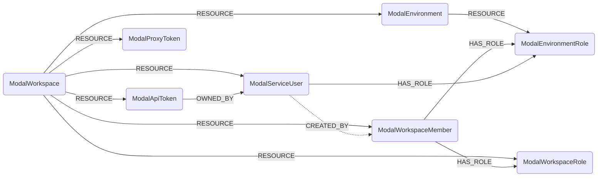

# Modal Schema



### ModalWorkspace

Represents a Modal workspace, the top of the Modal hierarchy. One workspace is derived from
the API token used to sync, via `TokenInfoGet`.

> **Ontology Mapping**: This node has the extra label `Tenant` to enable cross-platform
> queries for organizational tenants across different systems (e.g. OktaOrganization,
> AzureTenant, GCPOrganization).

Because a workspace is derived from the credential rather than enumerated, this node has no
sub-resource relationship and is never subject to a cleanup job: deleting it globally would
remove a sibling workspace ingested by a second token into the same graph.

#### Relationships

- A Modal workspace contains environments and workspace-global identity objects.

    ```
    (:ModalWorkspace)-[:RESOURCE]->(:ModalEnvironment)
    (:ModalWorkspace)-[:RESOURCE]->(:ModalWorkspaceRole)
    (:ModalWorkspace)-[:RESOURCE]->(:ModalWorkspaceMember)
    (:ModalWorkspace)-[:RESOURCE]->(:ModalServiceUser)
    (:ModalWorkspace)-[:RESOURCE]->(:ModalApiToken)
    (:ModalWorkspace)-[:RESOURCE]->(:ModalProxyToken)
    ```

| Field | Description |
|-------|-------------|
| **id** | Workspace ID, e.g. `ac-DyLbE2VtEfgvSEhzMQAOcP`. |
| **name** | Workspace display name. |
| **slug** | Workspace URL slug. Web endpoint hostnames embed it. |
| synced_with_token_id | ID of the API token that performed the sync. |
| synced_with_token_name | Name of that token. |
| **synced_with_principal_type** | `user` or `service_user`. Modal has no read-only token scope, so this records how privileged the sync credential was. |
| synced_with_principal_id | ID of the user or service user that owns the sync token. |
| synced_with_principal_name | Name of that principal. |
| synced_with_token_expires_at | Token expiry, if any. Modal API tokens do not normally expire. |
| firstseen | Timestamp of when a sync job first created this node. |
| lastupdated | Timestamp of the last time the node was updated. |

### ModalEnvironment

Represents a Modal environment: a namespace within a workspace. Every named object (app,
secret, volume, ...) belongs to exactly one environment, and every Modal listing call is
keyed by environment, which makes the environment the cleanup scope for all
environment-scoped Modal nodes.

> **Ontology Mapping**: This node has the extra label `Tenant`.

`ComputeNamespace` would be the closer semantic fit, but the ontology constrains
`ComputeService`/`ComputePod` to `ComputeNamespace` edges to `WORKLOAD_PARENT` in both
directions, which the `RESOURCE` sub-resource edge would violate. The environment name is
instead exposed to the ontology as `_ont_namespace` on the workload nodes.

#### Relationships

- An environment belongs to a workspace and contains its role definitions.

    ```
    (:ModalWorkspace)-[:RESOURCE]->(:ModalEnvironment)
    (:ModalEnvironment)-[:RESOURCE]->(:ModalEnvironmentRole)
    ```

| Field | Description |
|-------|-------------|
| **id** | Environment ID, e.g. `en-C3umado26sLFrhYfZjoWjL`. |
| **name** | Environment name. |
| **webhook_suffix** | Suffix appended to generated web endpoint URLs in this environment. |
| created_at | When the environment was created. |
| is_default | Whether this is the workspace's default environment. |
| is_managed | Whether the environment is managed by Modal. |
| environment_type | Raw `ENVIRONMENT_TYPE_*` value. |
| max_concurrent_tasks | Concurrency limit on tasks. |
| max_concurrent_gpus | Concurrency limit on GPUs. |
| current_concurrent_tasks | Tasks currently running. |
| current_concurrent_gpus | GPUs currently in use. |
| spend_limit_reached | Whether the spend limit has been hit. Workloads are refused when true. Cost figures themselves are out of scope. |
| firstseen | Timestamp of when a sync job first created this node. |
| lastupdated | Timestamp of the last time the node was updated. |

### ModalWorkspaceMember

Represents a human member of a Modal workspace.

> **Ontology Mapping**: This node has the extra label `UserAccount` to enable
> cross-platform identity queries, and feeds the canonical `User` node.

#### Relationships

- A member belongs to a workspace and holds workspace and environment roles.

    ```
    (:ModalWorkspace)-[:RESOURCE]->(:ModalWorkspaceMember)
    (:ModalWorkspaceMember)-[:HAS_ROLE]->(:ModalWorkspaceRole)
    (:ModalWorkspaceMember)-[:HAS_ROLE]->(:ModalEnvironmentRole)
    ```

| Field | Description |
|-------|-------------|
| **id** | User ID, e.g. `us-ydIZVCWluEtzFTbpJvjHcK`. |
| member_id | Workspace membership ID. |
| **email** | Member email address. |
| **display_name** | Member display name, which is also the workspace username Modal uses to attribute object creation. |
| **member_role** | Raw `MEMBER_ROLE_*` value. |
| **identity_provider_type** | `IDENTITY_PROVIDER_TYPE_GITHUB`, `_OKTA` or `_GOOGLE_OAUTH`. A non-SSO provider in an SSO-managed workspace is worth alerting on. |
| idp_external_id | The member's ID at the identity provider. |
| avatar_url | Avatar URL. |
| joined_at | When the member joined the workspace. |
| last_active_at | When the member was last active. Null if never. |
| deleted_at | When the membership was removed, if it was. |
| firstseen | Timestamp of when a sync job first created this node. |
| lastupdated | Timestamp of the last time the node was updated. |

### ModalWorkspaceRole

Represents one of Modal's builtin workspace roles (`member`, `manager`, `owner`). Modal has
no role API object, so these nodes are derived from the role enum and their id is
synthesised as `<workspace_id>/<role>`.

> **Ontology Mapping**: This node has the extra label `PermissionRole`.

Modelling roles as nodes rather than as a property on the member is what lets Modal RBAC
participate in cross-provider `HAS_ROLE` rules.

#### Relationships

- A role is defined in a workspace and held by members.

    ```
    (:ModalWorkspace)-[:RESOURCE]->(:ModalWorkspaceRole)
    (:ModalWorkspaceMember)-[:HAS_ROLE]->(:ModalWorkspaceRole)
    ```

| Field | Description |
|-------|-------------|
| **id** | Synthesised as `<workspace_id>/<role>`. |
| **name** | `member`, `manager` or `owner`. |
| scope | Always `workspace`. |
| firstseen | Timestamp of when a sync job first created this node. |
| lastupdated | Timestamp of the last time the node was updated. |

### ModalEnvironmentRole

Represents one of Modal's builtin per-environment roles (`viewer`, `contributor`,
`no-access`). Derived from the role enum; id is synthesised as `<environment_id>/<role>`.

> **Ontology Mapping**: This node has the extra label `PermissionRole`.

#### Relationships

- An environment role is defined in an environment and held by members or service users.

    ```
    (:ModalEnvironment)-[:RESOURCE]->(:ModalEnvironmentRole)
    (:ModalWorkspaceMember)-[:HAS_ROLE]->(:ModalEnvironmentRole)
    (:ModalServiceUser)-[:HAS_ROLE]->(:ModalEnvironmentRole)
    ```

| Field | Description |
|-------|-------------|
| **id** | Synthesised as `<environment_id>/<role>`. |
| **name** | `viewer`, `contributor` or `no-access`. |
| scope | Always `environment`. |
| firstseen | Timestamp of when a sync job first created this node. |
| lastupdated | Timestamp of the last time the node was updated. |

### ModalServiceUser

Represents a Modal service user: a machine identity that owns exactly one API token. This
is the recommended identity to run Cartography under.

> **Ontology Mapping**: This node has the extra label `ServiceAccount`.

#### Relationships

- A service user belongs to a workspace, owns an API token, holds environment roles, and
  was created by a member.

    ```
    (:ModalWorkspace)-[:RESOURCE]->(:ModalServiceUser)
    (:ModalApiToken)-[:OWNED_BY]->(:ModalServiceUser)
    (:ModalServiceUser)-[:HAS_ROLE]->(:ModalEnvironmentRole)
    (:ModalServiceUser)-[:CREATED_BY]->(:ModalWorkspaceMember)
    ```

  `CREATED_BY` is best-effort: Modal reports the creator only as a workspace username, so
  the edge joins on `ModalWorkspaceMember.display_name` and is simply absent when no member
  matches.

| Field | Description |
|-------|-------------|
| **id** | Service user ID. |
| **name** | Service user name. |
| created_at | When the service user was created. |
| **created_by** | Workspace username of the creator, not an email. |
| firstseen | Timestamp of when a sync job first created this node. |
| lastupdated | Timestamp of the last time the node was updated. |

### ModalApiToken

Represents a Modal API token (`ak-`) belonging to a service user. Only the token id is
stored; the token secret is shown once at creation and is never returned by any read API.

> **Ontology Mapping**: This node has the extra label `APIKey`.

#### Relationships

- A token belongs to a workspace and is owned by the identity it authenticates as.

    ```
    (:ModalWorkspace)-[:RESOURCE]->(:ModalApiToken)
    (:ModalApiToken)-[:OWNED_BY]->(:ModalServiceUser)
    ```

| Field | Description |
|-------|-------------|
| **id** | Token ID, e.g. `ak-4pE5t96YiNM0svmOjIet7z`. |
| **token_id** | Same value, indexed for lookups by credential. |
| **name** | Name of the owning service user. |
| created_at | When the token was created. |
| last_used_at | When the token was last used. Modal tokens do not expire, so this is the only signal that one is dormant. |
| firstseen | Timestamp of when a sync job first created this node. |
| lastupdated | Timestamp of the last time the node was updated. |

### ModalProxyToken

Represents a Modal proxy auth token (`wk-`), used to authenticate to web endpoints declared
with proxy auth. This is a different credential family from API tokens and the two cannot be
interchanged.

> **Ontology Mapping**: This node has the extra label `APIKey`.

Cartography can enumerate proxy tokens but **not** which endpoints require them:
`requires_proxy_auth` is write-only in Modal's API.

#### Relationships

- A proxy token belongs to a workspace.

    ```
    (:ModalWorkspace)-[:RESOURCE]->(:ModalProxyToken)
    ```

| Field | Description |
|-------|-------------|
| **id** | Proxy token ID, e.g. `wk-5TgBnHyUjMkIoLpQaZwSxE`. |
| **token_id** | Same value, indexed. |
| created_at | When the token was created. |
| **scoped** | Whether the token is restricted to specific environments. An unscoped token authenticates against every proxy-auth-protected endpoint in the workspace, so this is the blast-radius signal. |
| firstseen | Timestamp of when a sync job first created this node. |
| lastupdated | Timestamp of the last time the node was updated. |
