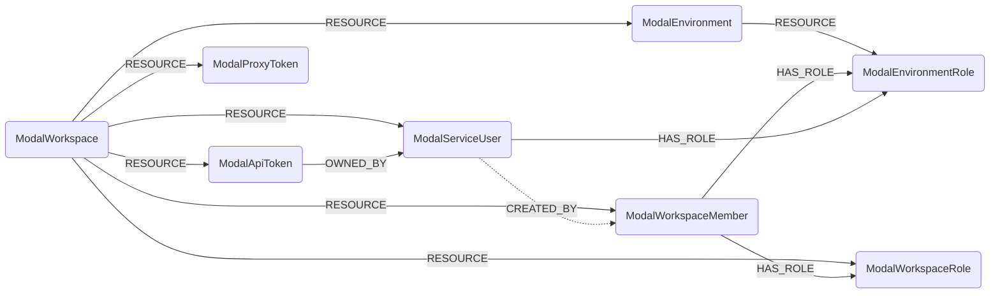
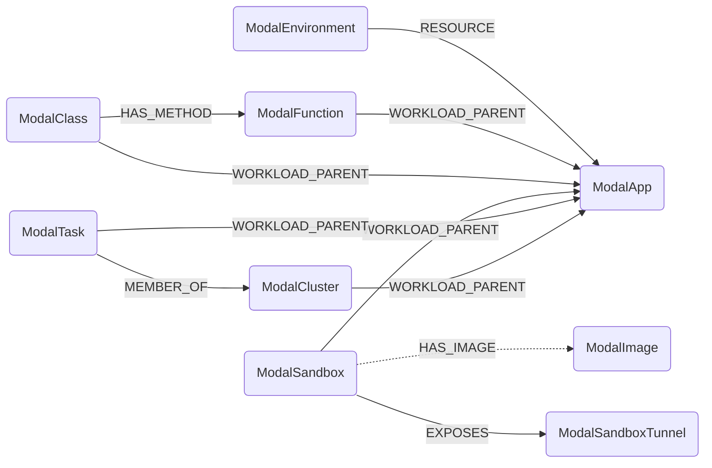

# Modal Schema

Identity and tenancy:



Compute. Every environment-scoped node also hangs off its `ModalEnvironment` with
`RESOURCE`, omitted here for readability:



### ModalWorkspace

Represents a Modal workspace, the top of the Modal hierarchy. One workspace is derived from
the API token used to sync, via `TokenInfoGet`.

> **Ontology Mapping**: This node has the extra label `Tenant` to enable cross-platform
> queries for organizational tenants across different systems (e.g. OktaOrganization,
> AzureTenant, GCPOrganization).

Because a workspace is derived from the credential rather than enumerated, this node has no
sub-resource relationship and is never subject to a cleanup job: deleting it globally would
remove a sibling workspace ingested by a second token into the same graph.

#### Relationships

- A Modal workspace contains environments and workspace-global identity objects.

    ```
    (:ModalWorkspace)-[:RESOURCE]->(:ModalEnvironment)
    (:ModalWorkspace)-[:RESOURCE]->(:ModalWorkspaceRole)
    (:ModalWorkspace)-[:RESOURCE]->(:ModalWorkspaceMember)
    (:ModalWorkspace)-[:RESOURCE]->(:ModalServiceUser)
    (:ModalWorkspace)-[:RESOURCE]->(:ModalApiToken)
    (:ModalWorkspace)-[:RESOURCE]->(:ModalProxyToken)
    ```

| Field | Description |
|-------|-------------|
| **id** | Workspace ID, e.g. `ac-DyLbE2VtEfgvSEhzMQAOcP`. |
| **name** | Workspace display name. |
| **slug** | Workspace URL slug. Web endpoint hostnames embed it. |
| synced_with_token_id | ID of the API token that performed the sync. |
| synced_with_token_name | Name of that token. |
| **synced_with_principal_type** | `user` or `service_user`. Modal has no read-only token scope, so this records how privileged the sync credential was. |
| synced_with_principal_id | ID of the user or service user that owns the sync token. |
| synced_with_principal_name | Name of that principal. |
| synced_with_token_expires_at | Token expiry, if any. Modal API tokens do not normally expire. |
| firstseen | Timestamp of when a sync job first created this node. |
| lastupdated | Timestamp of the last time the node was updated. |

### ModalEnvironment

Represents a Modal environment: a namespace within a workspace. Every named object (app,
secret, volume, ...) belongs to exactly one environment, and every Modal listing call is
keyed by environment, which makes the environment the cleanup scope for all
environment-scoped Modal nodes.

> **Ontology Mapping**: This node has the extra label `Tenant`.

`ComputeNamespace` would be the closer semantic fit, but the ontology constrains
`ComputeService`/`ComputePod` to `ComputeNamespace` edges to `WORKLOAD_PARENT` in both
directions, which the `RESOURCE` sub-resource edge would violate. The environment name is
instead exposed to the ontology as `_ont_namespace` on the workload nodes.

#### Relationships

- An environment belongs to a workspace and contains its role definitions.

    ```
    (:ModalWorkspace)-[:RESOURCE]->(:ModalEnvironment)
    (:ModalEnvironment)-[:RESOURCE]->(:ModalEnvironmentRole)
    ```

| Field | Description |
|-------|-------------|
| **id** | Environment ID, e.g. `en-C3umado26sLFrhYfZjoWjL`. |
| **name** | Environment name. |
| **webhook_suffix** | Suffix appended to generated web endpoint URLs in this environment. |
| created_at | When the environment was created. |
| is_default | Whether this is the workspace's default environment. |
| is_managed | Whether the environment is managed by Modal. |
| environment_type | Raw `ENVIRONMENT_TYPE_*` value. |
| max_concurrent_tasks | Concurrency limit on tasks. |
| max_concurrent_gpus | Concurrency limit on GPUs. |
| current_concurrent_tasks | Tasks currently running. |
| current_concurrent_gpus | GPUs currently in use. |
| spend_limit_reached | Whether the spend limit has been hit. Workloads are refused when true. Cost figures themselves are out of scope. |
| firstseen | Timestamp of when a sync job first created this node. |
| lastupdated | Timestamp of the last time the node was updated. |

### ModalWorkspaceMember

Represents a human member of a Modal workspace.

> **Ontology Mapping**: This node has the extra label `UserAccount` to enable
> cross-platform identity queries, and feeds the canonical `User` node.

#### Relationships

- A member belongs to a workspace and holds workspace and environment roles.

    ```
    (:ModalWorkspace)-[:RESOURCE]->(:ModalWorkspaceMember)
    (:ModalWorkspaceMember)-[:HAS_ROLE]->(:ModalWorkspaceRole)
    (:ModalWorkspaceMember)-[:HAS_ROLE]->(:ModalEnvironmentRole)
    ```

| Field | Description |
|-------|-------------|
| **id** | User ID, e.g. `us-ydIZVCWluEtzFTbpJvjHcK`. |
| member_id | Workspace membership ID. |
| **email** | Member email address. |
| **display_name** | Member display name, which is also the workspace username Modal uses to attribute object creation. |
| **member_role** | Raw `MEMBER_ROLE_*` value. |
| **identity_provider_type** | `IDENTITY_PROVIDER_TYPE_GITHUB`, `_OKTA` or `_GOOGLE_OAUTH`. A non-SSO provider in an SSO-managed workspace is worth alerting on. |
| idp_external_id | The member's ID at the identity provider. |
| avatar_url | Avatar URL. |
| joined_at | When the member joined the workspace. |
| last_active_at | When the member was last active. Null if never. |
| deleted_at | When the membership was removed, if it was. |
| firstseen | Timestamp of when a sync job first created this node. |
| lastupdated | Timestamp of the last time the node was updated. |

### ModalWorkspaceRole

Represents one of Modal's builtin workspace roles (`member`, `manager`, `owner`). Modal has
no role API object, so these nodes are derived from the role enum and their id is
synthesised as `<workspace_id>/<role>`.

> **Ontology Mapping**: This node has the extra label `PermissionRole`.

Modelling roles as nodes rather than as a property on the member is what lets Modal RBAC
participate in cross-provider `HAS_ROLE` rules.

#### Relationships

- A role is defined in a workspace and held by members.

    ```
    (:ModalWorkspace)-[:RESOURCE]->(:ModalWorkspaceRole)
    (:ModalWorkspaceMember)-[:HAS_ROLE]->(:ModalWorkspaceRole)
    ```

| Field | Description |
|-------|-------------|
| **id** | Synthesised as `<workspace_id>/<role>`. |
| **name** | `member`, `manager` or `owner`. |
| scope | Always `workspace`. |
| firstseen | Timestamp of when a sync job first created this node. |
| lastupdated | Timestamp of the last time the node was updated. |

### ModalEnvironmentRole

Represents one of Modal's builtin per-environment roles (`viewer`, `contributor`,
`no-access`). Derived from the role enum; id is synthesised as `<environment_id>/<role>`.

> **Ontology Mapping**: This node has the extra label `PermissionRole`.

#### Relationships

- An environment role is defined in an environment and held by members or service users.

    ```
    (:ModalEnvironment)-[:RESOURCE]->(:ModalEnvironmentRole)
    (:ModalWorkspaceMember)-[:HAS_ROLE]->(:ModalEnvironmentRole)
    (:ModalServiceUser)-[:HAS_ROLE]->(:ModalEnvironmentRole)
    ```

| Field | Description |
|-------|-------------|
| **id** | Synthesised as `<environment_id>/<role>`. |
| **name** | `viewer`, `contributor` or `no-access`. |
| scope | Always `environment`. |
| firstseen | Timestamp of when a sync job first created this node. |
| lastupdated | Timestamp of the last time the node was updated. |

### ModalServiceUser

Represents a Modal service user: a machine identity that owns exactly one API token. This
is the recommended identity to run Cartography under.

> **Ontology Mapping**: This node has the extra label `ServiceAccount`.

#### Relationships

- A service user belongs to a workspace, owns an API token, holds environment roles, and
  was created by a member.

    ```
    (:ModalWorkspace)-[:RESOURCE]->(:ModalServiceUser)
    (:ModalApiToken)-[:OWNED_BY]->(:ModalServiceUser)
    (:ModalServiceUser)-[:HAS_ROLE]->(:ModalEnvironmentRole)
    (:ModalServiceUser)-[:CREATED_BY]->(:ModalWorkspaceMember)
    ```

  `CREATED_BY` is best-effort: Modal reports the creator only as a workspace username, so
  the edge joins on `ModalWorkspaceMember.display_name` and is simply absent when no member
  matches.

| Field | Description |
|-------|-------------|
| **id** | Service user ID. |
| **name** | Service user name. |
| created_at | When the service user was created. |
| **created_by** | Workspace username of the creator, not an email. |
| firstseen | Timestamp of when a sync job first created this node. |
| lastupdated | Timestamp of the last time the node was updated. |

### ModalApiToken

Represents a Modal API token (`ak-`) belonging to a service user. Only the token id is
stored; the token secret is shown once at creation and is never returned by any read API.

> **Ontology Mapping**: This node has the extra label `APIKey`.

#### Relationships

- A token belongs to a workspace and is owned by the identity it authenticates as.

    ```
    (:ModalWorkspace)-[:RESOURCE]->(:ModalApiToken)
    (:ModalApiToken)-[:OWNED_BY]->(:ModalServiceUser)
    ```

| Field | Description |
|-------|-------------|
| **id** | Token ID, e.g. `ak-4pE5t96YiNM0svmOjIet7z`. |
| **token_id** | Same value, indexed for lookups by credential. |
| **name** | Name of the owning service user. |
| created_at | When the token was created. |
| last_used_at | When the token was last used. Modal tokens do not expire, so this is the only signal that one is dormant. |
| firstseen | Timestamp of when a sync job first created this node. |
| lastupdated | Timestamp of the last time the node was updated. |

### ModalProxyToken

Represents a Modal proxy auth token (`wk-`), used to authenticate to web endpoints declared
with proxy auth. This is a different credential family from API tokens and the two cannot be
interchanged.

> **Ontology Mapping**: This node has the extra label `APIKey`.

Cartography can enumerate proxy tokens but **not** which endpoints require them:
`requires_proxy_auth` is write-only in Modal's API.

#### Relationships

- A proxy token belongs to a workspace.

    ```
    (:ModalWorkspace)-[:RESOURCE]->(:ModalProxyToken)
    ```

| Field | Description |
|-------|-------------|
| **id** | Proxy token ID, e.g. `wk-5TgBnHyUjMkIoLpQaZwSxE`. |
| **token_id** | Same value, indexed. |
| created_at | When the token was created. |
| **scoped** | Whether the token is restricted to specific environments. An unscoped token authenticates against every proxy-auth-protected endpoint in the workspace, so this is the blast-radius signal. |
| firstseen | Timestamp of when a sync job first created this node. |
| lastupdated | Timestamp of the last time the node was updated. |

### ModalApp

Represents a Modal app: the deployment unit that owns functions, classes, sandboxes and
tasks. Enumerated from the private `AppList` RPC, since Modal exposes no public app listing.

> **Ontology Mapping**: This node has the extra label `ComputeService`, making it the parent
> of the Modal workload chain, alongside AWS ECS services and GCP Cloud Run services.

An ephemeral app (a bare `modal run`) has no name, only a description; the ontology `name`
coalesces the two. `_ont_status` normalises `APP_STATE_*` into the shared set, where a stopped
app maps to `deleting` (the same choice made for AWS ECS `INACTIVE`), because the canonical
set has no `stopped`.

#### Relationships

- An app belongs to an environment and is the workload parent of everything it runs.

    ```
    (:ModalEnvironment)-[:RESOURCE]->(:ModalApp)
    (:ModalFunction)-[:WORKLOAD_PARENT]->(:ModalApp)
    (:ModalClass)-[:WORKLOAD_PARENT]->(:ModalApp)
    (:ModalSandbox)-[:WORKLOAD_PARENT]->(:ModalApp)
    (:ModalTask)-[:WORKLOAD_PARENT]->(:ModalApp)
    (:ModalCluster)-[:WORKLOAD_PARENT]->(:ModalApp)
    ```

| Field | Description |
|-------|-------------|
| **id** | App ID, e.g. `ap-7fkFcwJ6OVd57wM78ERlH1`. |
| **name** | App name. Null for an ephemeral app. |
| description | App description. The only human label for an unnamed app. |
| **state** | Raw `APP_STATE_*` value. |
| created_at | When the app was created. |
| stopped_at | When the app was stopped, if it was. |
| n_running_tasks | Number of tasks currently running. |
| **environment_name** | Name of the owning environment. |
| firstseen | Timestamp of when a sync job first created this node. |
| lastupdated | Timestamp of the last time the node was updated. |

### ModalFunction

Represents a deployed Modal function, including web endpoints. Enumerated per app from the
private `AppGetLayout` RPC.

> **Ontology Mapping**: This node has the extra label `Function`, for cross-provider queries
> alongside AWSLambda, GCPCloudFunction and AzureFunctionApp.

**Every non-null `web_url` is reachable from the public internet.** Cartography cannot tell
you whether it is protected: Modal's `requires_proxy_auth` is write-only and is not returned
by any read API. Treat such endpoints as potentially unauthenticated and confirm out of band.

For the same reason, a deployed function's GPU, CPU, memory, timeout, region, cloud, mounted
secrets and volumes, `block_network`, `untrusted`, proxy and schedule are **absent from this
node**: Modal only accepts them at deploy time and never returns them. In particular this
means `(:ModalFunction)-[:USES_SECRET]->(:ModalSecret)` cannot be built.

#### Relationships

- A function belongs to an environment, runs under an app, and may be a method of a class.

    ```
    (:ModalEnvironment)-[:RESOURCE]->(:ModalFunction)
    (:ModalFunction)-[:WORKLOAD_PARENT]->(:ModalApp)
    (:ModalClass)-[:HAS_METHOD]->(:ModalFunction)
    ```

| Field | Description |
|-------|-------------|
| **id** | Function ID, e.g. `fu-Z8U7DHNMEog5ogYErpRIW8`. |
| **name** | Function name. A class method is named `<Class>.<method>`, and a class service function `<Class>.*`. |
| app_id | ID of the owning app. |
| **web_url** | Public URL if this is a web endpoint, else null. Protection status is unknowable, see above. |
| **is_web_endpoint** | Whether the function is exposed over HTTP. |
| function_type | Raw `FUNCTION_TYPE_*` value. |
| is_method | Whether Modal reports this function as a class method. |
| definition_id | Function definition ID, when Modal returns one. |
| input_plane_url | Input plane endpoint serving this function. |
| input_plane_region | Region of that input plane. |
| **environment_name** | Name of the owning environment. |
| firstseen | Timestamp of when a sync job first created this node. |
| lastupdated | Timestamp of the last time the node was updated. |

### ModalClass

Represents a Modal class, which groups methods sharing a container lifecycle. It carries no
ontology label of its own: the runnable units are its methods, which are `ModalFunction`
nodes.

#### Relationships

- A class belongs to an environment, runs under an app, and owns its methods.

    ```
    (:ModalEnvironment)-[:RESOURCE]->(:ModalClass)
    (:ModalClass)-[:WORKLOAD_PARENT]->(:ModalApp)
    (:ModalClass)-[:HAS_METHOD]->(:ModalFunction)
    ```

  `HAS_METHOD` is best-effort: it is resolved from the `<Class>.` prefix of the function name,
  so a function whose prefix matches no known class simply has no edge.

| Field | Description |
|-------|-------------|
| **id** | Class ID, e.g. `cs-35B2OoyjwFlvFPNjBMCrPK`. |
| **name** | Class name. |
| app_id | ID of the owning app. |
| **environment_name** | Name of the owning environment. |
| firstseen | Timestamp of when a sync job first created this node. |
| lastupdated | Timestamp of the last time the node was updated. |

### ModalSandbox

Represents a running Modal sandbox: an ad-hoc container, commonly used to run untrusted or
agent-generated code.

> **Ontology Mapping**: This node has the extra label `Container`, for cross-provider queries
> alongside KubernetesContainer, AWSECSContainer and AzureContainerInstance.

Only **live** sandboxes are ingested; finished ones are ephemeral and would otherwise
accumulate forever. Unlike functions, sandboxes **do** expose their resource allocation,
regions and tunnels. Modal reports no state field, so `state` is derived from the task result
plus readiness: `PENDING` and `RUNNING` are synthetic values, the rest are raw
`GENERIC_STATUS_*` values.

A long `timeout_secs` combined with an exposed tunnel is the sharpest exposure signal on this
node.

#### Relationships

- A sandbox belongs to an environment, runs under an app, may run a named image, and exposes
  its forwarded ports.

    ```
    (:ModalEnvironment)-[:RESOURCE]->(:ModalSandbox)
    (:ModalSandbox)-[:WORKLOAD_PARENT]->(:ModalApp)
    (:ModalSandbox)-[:HAS_IMAGE]->(:ModalImage)
    (:ModalSandbox)-[:EXPOSES]->(:ModalSandboxTunnel)
    ```

  `HAS_IMAGE` only resolves when the sandbox runs a *named* image, since anonymous build
  images are not enumerable.

| Field | Description |
|-------|-------------|
| **id** | Sandbox ID, e.g. `sb-iSd0kw3efjqPw0yPVelPit`. |
| **name** | Sandbox name, if one was given. |
| app_id | ID of the owning app. |
| **state** | `PENDING`, `RUNNING`, or a raw `GENERIC_STATUS_*` value. |
| created_at | When the sandbox was created. |
| ready_at | When the sandbox became ready. Null while still starting. |
| **image_id** | ID of the image it runs. |
| memory_mb | Requested memory in MB. |
| memory_mb_max | Memory limit in MB, if set. |
| milli_cpu | Requested CPU in millicores. |
| milli_cpu_max | CPU limit in millicores, if set. |
| **gpu_type** | Raw `GPU_TYPE_*` value, null for a CPU-only sandbox. |
| ephemeral_disk_mb | Ephemeral disk in MB, if set. |
| regions | Regions the sandbox may run in. |
| **region** | Set only when exactly one region is pinned, so it can join the ontology's scalar region. Null for a multi-region sandbox. |
| timeout_secs | Hard lifetime in seconds. |
| idle_timeout_secs | Idle timeout in seconds, if set. |
| tags | Sandbox tags, flattened to `key=value` strings. |
| **environment_name** | Name of the owning environment. |
| firstseen | Timestamp of when a sync job first created this node. |
| lastupdated | Timestamp of the last time the node was updated. |

### ModalSandboxTunnel

Represents a forwarded port on a running sandbox, reachable from the public internet. This is
the main inbound exposure surface of a Modal sandbox.

#### Relationships

- A tunnel belongs to an environment and is exposed by its sandbox.

    ```
    (:ModalEnvironment)-[:RESOURCE]->(:ModalSandboxTunnel)
    (:ModalSandbox)-[:EXPOSES]->(:ModalSandboxTunnel)
    ```

| Field | Description |
|-------|-------------|
| **id** | Synthesised as `<sandbox_id>/<container_port>`; Modal gives tunnels no id. |
| sandbox_id | ID of the exposing sandbox. |
| **host** | Public TLS hostname. |
| port | Public TLS port. |
| **unencrypted_host** | Set only for a tunnel opened on an unencrypted port. Traffic to it is cleartext over the public internet. |
| unencrypted_port | The unencrypted port, if any. |
| **has_unencrypted_endpoint** | Precomputed flag so cleartext exposure is directly queryable. |
| container_port | Port inside the container. |
| **environment_name** | Name of the owning environment. |
| firstseen | Timestamp of when a sync job first created this node. |
| lastupdated | Timestamp of the last time the node was updated. |

### ModalTask

Represents a running Modal container task.

> **Ontology Mapping**: This node has the extra label `ComputePod`, alongside KubernetesPod
> and AWSECSTask. `_ont_status` is statically `running` and `_ont_name` is the task id, since
> Modal returns only live tasks and does not name them.

#### Relationships

- A task belongs to an environment, runs under an app, and may belong to a cluster.

    ```
    (:ModalEnvironment)-[:RESOURCE]->(:ModalTask)
    (:ModalTask)-[:WORKLOAD_PARENT]->(:ModalApp)
    (:ModalTask)-[:MEMBER_OF]->(:ModalCluster)
    ```

| Field | Description |
|-------|-------------|
| **id** | Task ID, e.g. `ta-01KYQX24W4D7NW306JQ5D98X7S`. |
| app_id | ID of the owning app. |
| app_description | Description of the owning app. |
| started_at | When the task started running. |
| enqueued_at | When the task was enqueued. |
| cluster_id | ID of the cluster it belongs to, if any. |
| **environment_name** | Name of the owning environment. |
| firstseen | Timestamp of when a sync job first created this node. |
| lastupdated | Timestamp of the last time the node was updated. |

### ModalCluster

Represents a Modal cluster: the group of tasks making up one multi-node job.

This node deliberately carries **no** `ComputeCluster` ontology label. A Modal cluster is not
a durable compute substrate like EKS, it is a transient task grouping inside a single app, and
the label's ontology constraints against `ComputePod` and `ComputeService` would conflict with
the `MEMBER_OF` and `WORKLOAD_PARENT` edges here.

#### Relationships

- A cluster belongs to an environment, runs under an app, and groups tasks.

    ```
    (:ModalEnvironment)-[:RESOURCE]->(:ModalCluster)
    (:ModalCluster)-[:WORKLOAD_PARENT]->(:ModalApp)
    (:ModalTask)-[:MEMBER_OF]->(:ModalCluster)
    ```

| Field | Description |
|-------|-------------|
| **id** | Cluster ID. |
| app_id | ID of the owning app. |
| started_at | When the cluster started. |
| task_ids | IDs of its member tasks. The edge itself is materialised from the task side. |
| **environment_name** | Name of the owning environment. |
| firstseen | Timestamp of when a sync job first created this node. |
| lastupdated | Timestamp of the last time the node was updated. |

### ModalImage

Represents a named, published Modal image.

This node deliberately carries **no** `Image` ontology label. That label means a concrete,
digest-addressed single-platform image and drives the `RESOLVED_IMAGE` / `HAS_RUNTIME_IMAGE`
analysis; a Modal image id is neither a digest nor a pull URI, so tagging it would inject
nodes that can never be joined against a registry image.

Only **named** images are enumerable. Anonymous build images (the common case, such as an
inline `Image.debian_slim()`) are not returned by the API and are therefore absent, which is
why a sandbox's `HAS_IMAGE` edge often does not resolve.

#### Relationships

- An image belongs to an environment and may be run by sandboxes.

    ```
    (:ModalEnvironment)-[:RESOURCE]->(:ModalImage)
    (:ModalSandbox)-[:HAS_IMAGE]->(:ModalImage)
    ```

| Field | Description |
|-------|-------------|
| **id** | Image ID, e.g. `im-m0JhBY9qYlH5iisTrhhftT`. |
| **tag** | Image tag. |
| revision_id | Revision of the tag. |
| created_at | When the image was created. |
| updated_at | When the image was last updated. |
| **environment_name** | Name of the owning environment. |
| firstseen | Timestamp of when a sync job first created this node. |
| lastupdated | Timestamp of the last time the node was updated. |
