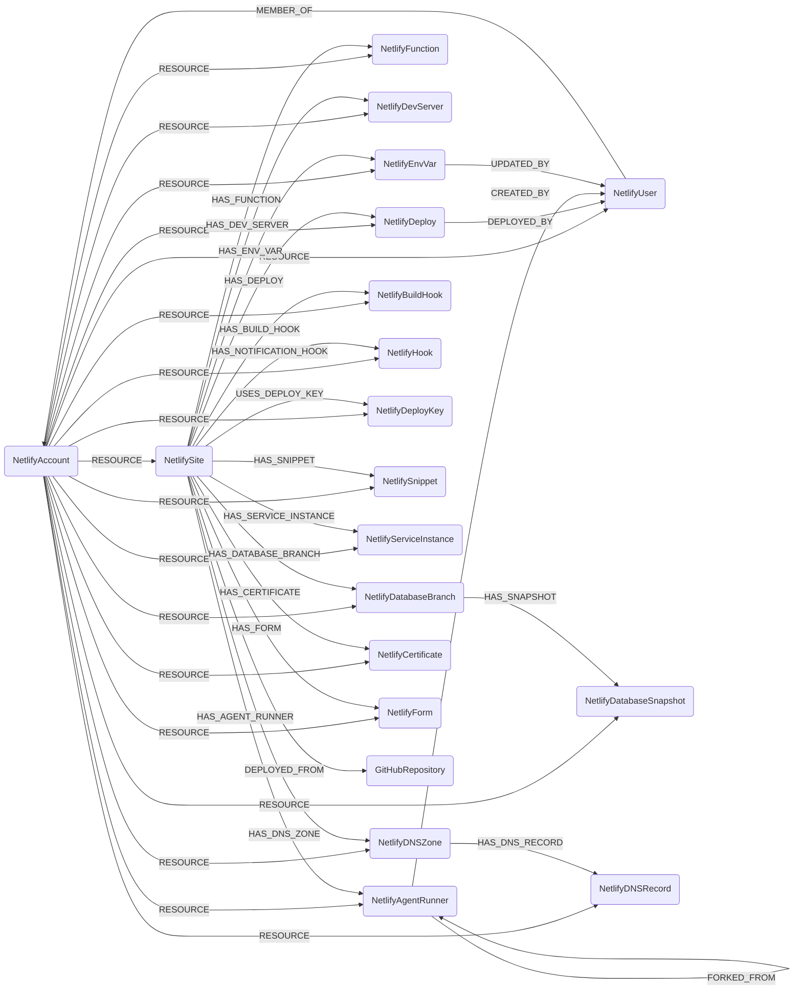

## Netlify Schema



Netlify has a single tenancy level. A **team** (`NetlifyAccount`) owns everything, and every
node in this module is scoped to that team for cleanup, including the ones that also hang off a
site. One Cartography run syncs one team.

### NetlifyAccount

Representation of a Netlify [team](https://open-api.netlify.com/#tag/account).

> **Ontology Mapping**: This node has the extra label `Tenant` to enable cross-platform queries
> for the owning organization across different systems (e.g., AWSAccount, GCPProject,
> VercelTeam).

| Field | Description |
|---|---|
| firstseen | Timestamp of when a sync job first discovered this node |
| lastupdated | Timestamp of the last time the node was updated |
| **id** | The Netlify team id |
| **name** | Display name of the team |
| **slug** | URL slug of the team, used to address it in the API |
| lifecycle_state | Team lifecycle state, e.g. `active` |
| type_name | Human-readable plan name, e.g. `Free`, `Pro` |
| type_slug | Plan identifier, e.g. `credit-free` |
| enforce_mfa | Whether MFA is enforced for team members (`not_enforced` / `enforced`) |
| enforce_saml | Whether SAML sign-in is enforced for team members |
| saml_enabled | Whether SAML is configured on this team |
| org_mfa_enabled | Whether the parent organization has MFA turned on |
| org_saml_enabled | Whether the parent organization has SAML turned on |
| saml_session_expiration | SAML session lifetime in seconds |
| site_access | Default site access granted to members (`all`, `none`, ...) |
| site_sso_login | Whether team SSO is required to view the team's sites |
| site_sso_login_context | Which deploy contexts the site SSO requirement applies to |
| has_site_password | Whether a team-wide site password is set |
| site_password_context | Which deploy contexts the site password applies to |
| team_registration_domains | Email domains whose users can join the team without an invite |
| roles_allowed | Member roles this plan permits |
| owner_ids | User ids of the team owners |
| members_count | Number of accepted members |
| block_site_transfers | Whether transferring sites out of the team is blocked |
| support_administration_enabled | Whether Netlify support staff may access the team's resources |
| billing_email | Billing contact address |
| created_at | When the team was created |
| updated_at | When the team was last modified |

#### Relationships

- A Netlify team owns every other Netlify resource. Every node in this module has this edge.
    ```cypher
    (:NetlifyAccount)-[:RESOURCE]->(:NetlifySite)
    (:NetlifyAccount)-[:RESOURCE]->(:NetlifyUser)
    (:NetlifyAccount)-[:RESOURCE]->(:NetlifyDeploy)
    ```

### NetlifyUser

Representation of a member of a Netlify team
([member](https://open-api.netlify.com/#tag/member)).

> **Ontology Mapping**: This node has the extra label `UserAccount` to enable cross-platform
> identity queries (e.g., GitHubUser, OktaUser, EntraUser).

The node is keyed on the person's `user_id` rather than the membership id, so one human is one
node even when they belong to several teams. Everything that varies per team lives on the
`MEMBER_OF` edge.

Because a Netlify user is a shared identity and one cartography run syncs one team, both of this
node's team edges are MatchLinks scoped to the team being synced, and **the node itself is never
deleted by a team's cleanup**. Removing someone from a team drops that team's `RESOURCE` and
`MEMBER_OF` edges and leaves the identity in place, since other teams and other modules may still
reference it. A person removed from their last team therefore keeps a bare `NetlifyUser` node with
no membership; query through `MEMBER_OF` rather than by node existence to ask who is on a team.

| Field | Description |
|---|---|
| firstseen | Timestamp of when a sync job first discovered this node |
| lastupdated | Timestamp of the last time the node was updated |
| **id** | The Netlify user id of the person |
| **email** | Email address |
| full_name | Display name. Netlify never splits this into first and last name. |
| avatar | Avatar image URL |
| mfa_enabled | Whether the account has MFA enabled |
| last_activity_date | Date of last activity, as a date string |
| connected_account_providers | Identity providers linked to the account, e.g. `["google"]` |

#### Relationships

- A Netlify user is a member of the team. Everything team-scoped is on the `MEMBER_OF` edge
  rather than the node, because the same person can hold a different role, site access grant and
  invitation state in every team they belong to, and Netlify reports all of it on a per-team
  membership payload: `membership_id`, `role`, `site_access`, `pending`,
  `managed_by_directory_sync`, `created_at` and `updated_at`. Note in particular that
  `pending` is per team, so "is this person active" is
  `(:NetlifyUser)-[r:MEMBER_OF]->(:NetlifyAccount) WHERE NOT r.pending`, and the ontology's
  `_ont_active` is deliberately not set: no identity-level equivalent exists.
    ```cypher
    (:NetlifyAccount)-[:RESOURCE]->(:NetlifyUser)
    (:NetlifyUser)-[:MEMBER_OF]->(:NetlifyAccount)
    ```

### NetlifySite

Representation of a Netlify [site](https://open-api.netlify.com/#tag/site): the deployed web
application, its entry points and its build configuration.

> **Ontology Mapping**: This node has the extra label `ComputeService` to enable cross-platform
> queries for workloads that serve traffic (e.g., AWSECSService, GCPCloudRunService,
> RailwayServiceInstance).

| Field | Description |
|---|---|
| firstseen | Timestamp of when a sync job first discovered this node |
| lastupdated | Timestamp of the last time the node was updated |
| **id** | The Netlify site id |
| **name** | Site name, which is also its `*.netlify.app` subdomain |
| state | Site state, e.g. `current`, `building`, `error` |
| lifecycle_state | Site lifecycle state, e.g. `active` |
| plan | Plan the site is billed on, e.g. `nf_team_dev` |
| **url** | Primary URL of the site |
| ssl_url | HTTPS URL of the site |
| admin_url | Netlify admin URL for the site |
| **default_domain** | Always-present `*.netlify.app` hostname |
| **custom_domain** | Customer's own primary domain, if set |
| domain_aliases | Additional domains serving the same site |
| branch_deploy_custom_domain | Custom domain pattern for branch deploys |
| deploy_preview_custom_domain | Custom domain pattern for deploy previews |
| ssl | Whether a TLS certificate is in place |
| force_ssl | Whether plain HTTP is redirected to HTTPS |
| ssl_status | Provisioning status of the certificate |
| automatic_tls_provisioning | Whether Netlify provisions certificates automatically |
| managed_dns | Whether the site's DNS is hosted on Netlify DNS |
| dns_zone_id | Id of the Netlify DNS zone serving the site, if any |
| has_password | Whether the site is behind a password. The password itself is never returned by the API. |
| password_context | Which deploy contexts the password applies to |
| sso_login | Whether Netlify SSO is required to view the site |
| sso_login_context | Which deploy contexts the SSO requirement applies to |
| account_sso_login | Whether the team-level SSO requirement applies to this site |
| has_jwt_secret | Whether a Netlify Identity JWT signing secret is configured. The secret itself is dropped. |
| jwt_roles_path | JSON path in the JWT where Netlify reads role claims |
| identity_instance_id | Netlify Identity instance backing the site, if any |
| prevent_non_git_prod_deploys | Whether production deploys must come from git rather than an upload |
| deploy_retention_in_days | How long deploys are kept |
| disabled | Whether the site has been taken offline |
| disabled_reason | Why the site was taken offline |
| build_image | Build image the site builds on, e.g. `noble` |
| functions_region | Region the site's serverless functions run in |
| functions_timeout | Function timeout in seconds |
| prerender | Prerendering setting |
| use_functions | Whether serverless functions are enabled |
| use_forms | Whether form detection is enabled |
| use_edge_handlers | Whether edge handlers are enabled |
| has_database | Whether a Netlify DB is attached |
| git_provider | Git provider backing the site, e.g. `github` |
| **repo_path** | Source repository in `owner/name` form, used to join to `GitHubRepository` |
| repo_url | Source repository URL |
| repo_branch | Production branch |
| repo_allowed_branches | Branches Netlify is allowed to build |
| repo_public | Whether the source repository is public |
| repo_private_logs | Whether build logs are kept private |
| repo_stop_builds | Whether automatic builds are paused |
| build_command | Build command |
| publish_dir | Directory published as the site root |
| functions_dir | Directory holding the serverless functions |
| deploy_key_id | Id of the deploy key used to clone the repository |
| created_at | When the site was created |
| updated_at | When the site was last modified |

#### Relationships

- A Netlify site is a resource of a Netlify team.
    ```cypher
    (:NetlifyAccount)-[:RESOURCE]->(:NetlifySite)
    ```

- A Netlify site is built from a source repository. Best-effort: the edge is only created when
  the same repository has also been ingested by the GitHub module, matched on `owner/name`.
    ```cypher
    (:NetlifySite)-[:DEPLOYED_FROM]->(:GitHubRepository)
    ```

- A Netlify site clones its repository with a deploy key.
    ```cypher
    (:NetlifySite)-[:USES_DEPLOY_KEY]->(:NetlifyDeployKey)
    ```

- A Netlify site owns everything deployed on or configured for it.
    ```cypher
    (:NetlifySite)-[:HAS_DEPLOY]->(:NetlifyDeploy)
    (:NetlifySite)-[:HAS_FUNCTION]->(:NetlifyFunction)
    (:NetlifySite)-[:HAS_DEV_SERVER]->(:NetlifyDevServer)
    (:NetlifySite)-[:HAS_AGENT_RUNNER]->(:NetlifyAgentRunner)
    (:NetlifySite)-[:HAS_DATABASE_BRANCH]->(:NetlifyDatabaseBranch)
    (:NetlifySite)-[:HAS_ENV_VAR]->(:NetlifyEnvVar)
    (:NetlifySite)-[:HAS_BUILD_HOOK]->(:NetlifyBuildHook)
    (:NetlifySite)-[:HAS_NOTIFICATION_HOOK]->(:NetlifyHook)
    (:NetlifySite)-[:HAS_SNIPPET]->(:NetlifySnippet)
    (:NetlifySite)-[:HAS_SERVICE_INSTANCE]->(:NetlifyServiceInstance)
    (:NetlifySite)-[:HAS_DNS_ZONE]->(:NetlifyDNSZone)
    (:NetlifySite)-[:HAS_CERTIFICATE]->(:NetlifyCertificate)
    (:NetlifySite)-[:HAS_FORM]->(:NetlifyForm)
    ```

### NetlifyDeploy

Representation of the [deploy](https://open-api.netlify.com/#tag/deploy) currently published on
a Netlify site.

Only the published deploy is ingested. Netlify keeps the full deploy history behind a paginated
endpoint that can hold thousands of entries per site, while the published deploy is embedded in
the site payload, so this costs no extra API request and gives a bounded, deterministic set that
cleanup can safely treat as exhaustive.

| Field | Description |
|---|---|
| firstseen | Timestamp of when a sync job first discovered this node |
| lastupdated | Timestamp of the last time the node was updated |
| **id** | The Netlify deploy id |
| site_id | Id of the site this deploy belongs to |
| name | Site name at deploy time |
| state | Deploy state, e.g. `ready`, `error`, `building` |
| context | Deploy context, e.g. `production`, `deploy-preview`, `branch-deploy` |
| deploy_source | How the deploy was submitted, e.g. `cli`, `git`, `api` |
| manual_deploy | Whether a prebuilt artifact was uploaded rather than built from git |
| build_id | Id of the build that produced the deploy, when there was one |
| branch | Branch the deploy was built from |
| **commit_ref** | Commit SHA the deploy was built from |
| commit_url | Link to the commit on the git provider |
| commit_message | Commit message |
| committer | Committer handle |
| public_repo | Whether the source repository was public at deploy time |
| strict_contributor_verification_failure | True when Netlify could not verify the committer against the team. Unattributed code reached the site. |
| agent_runner_id | Set when a Netlify AI agent runner produced the deploy rather than a human |
| secrets_scan_files_scanned | Number of files Netlify's secrets scanner checked |
| secrets_scan_matches_count | Number of secrets the scanner matched. The matched values themselves are never ingested. |
| url | Primary URL served by this deploy |
| ssl_url | HTTPS URL served by this deploy |
| deploy_url | Permalink URL of this specific deploy |
| deploy_ssl_url | HTTPS permalink of this specific deploy |
| admin_url | Netlify admin URL for the deploy |
| framework | Framework Netlify detected |
| functions_region | Region the deploy's functions run in |
| blobs_region | Region the deploy's blob store lives in |
| edge_functions_present | Whether the deploy ships edge functions |
| required_functions | Function ids the deploy requires |
| required_edge_functions | Edge function ids the deploy requires |
| database_branch_id | Netlify DB branch this deploy is wired to |
| draft | Whether the deploy is a draft |
| locked | Whether the deploy is pinned as published |
| skipped | Whether the build was skipped |
| error_message | Failure reason, when the deploy failed |
| review_id | Pull request number the deploy previews |
| review_url | Pull request URL the deploy previews |
| pending_review_reason | Why the deploy is awaiting review |
| deploy_time | How long the deploy took, in seconds |
| created_at | When the deploy was created |
| updated_at | When the deploy was last modified |
| published_at | When the deploy became the published one |

#### Relationships

- A deploy is published on a site and was submitted by a user.
    ```cypher
    (:NetlifyAccount)-[:RESOURCE]->(:NetlifyDeploy)
    (:NetlifySite)-[:HAS_DEPLOY]->(:NetlifyDeploy)
    (:NetlifyDeploy)-[:DEPLOYED_BY]->(:NetlifyUser)
    ```

### NetlifyFunction

Representation of a serverless [function](https://open-api.netlify.com/#tag/function) deployed
on a Netlify site.

> **Ontology Mapping**: This node has the extra label `Function` to enable cross-platform
> queries for serverless functions (e.g., AWSLambda, GCPCloudFunction, AzureFunctionApp).

| Field | Description |
|---|---|
| firstseen | Timestamp of when a sync job first discovered this node |
| lastupdated | Timestamp of the last time the node was updated |
| **id** | Composite `<site_id>\|<branch>\|<name>`. Netlify's own function ids are content hashes that change on every build, so keying on them would create a new node per deploy. |
| site_id | Id of the site the function is deployed on |
| **name** | Function name, which is also its route segment |
| branch | Branch the function bundle was built from |
| provider_function_id | Netlify's per-build function id |
| content_digest | Digest of the function's built artifact |
| runtime | Runtime the function executes on, e.g. `nodejs24.x` |
| region | Region the function runs in |
| memory_mb | Memory allocated to the function, in MB |
| size_bytes | Size of the built artifact |
| invocation_mode | How the function is invoked, e.g. `stream`, `buffer` |
| endpoint | Publicly reachable invocation URL |
| schedule | Cron expression, when the function runs on a schedule rather than on request |
| provider | Underlying compute provider, e.g. `aws_lambda` |
| provider_account_id | Provider account the function runs in |
| log_type | Logging pipeline the function reports to |
| created_at | When the function bundle was built |

#### Relationships

- A function is deployed on a site.
    ```cypher
    (:NetlifyAccount)-[:RESOURCE]->(:NetlifyFunction)
    (:NetlifySite)-[:HAS_FUNCTION]->(:NetlifyFunction)
    ```

### NetlifyDevServer

Representation of a Netlify [dev server](https://open-api.netlify.com/#tag/devServer): an
ephemeral container running a site's working copy.

> **Ontology Mapping**: This node has the extra label `ComputeInstance` to enable
> cross-platform queries for single compute instances (e.g., EC2Instance, GCPInstance,
> AzureVirtualMachine).

A running dev server is reachable at a public `devserver-<branch>--<site>.netlify.app`
hostname, so it exposes an unbuilt working copy of the site to the internet.

| Field | Description |
|---|---|
| firstseen | Timestamp of when a sync job first discovered this node |
| lastupdated | Timestamp of the last time the node was updated |
| **id** | The Netlify dev server id |
| site_id | Id of the site the dev server runs a copy of |
| title | Display title |
| state | Dev server state, e.g. `enqueued`, `starting`, `live`, `done` |
| branch | Branch the dev server serves |
| environment | Environment name the dev server runs as |
| **url** | Public hostname serving the dev server |
| stop_reason | Why the dev server stopped |
| last_activity_at | Last request the dev server served |
| enqueued_at | When the dev server was requested |
| starting_at | When the dev server began starting |
| live_at | When the dev server became reachable |
| error_at | When the dev server failed |
| done_at | When the dev server shut down |
| created_at | When the dev server was created |
| updated_at | When the dev server was last modified |

#### Relationships

- A dev server runs a copy of a site.
    ```cypher
    (:NetlifyAccount)-[:RESOURCE]->(:NetlifyDevServer)
    (:NetlifySite)-[:HAS_DEV_SERVER]->(:NetlifyDevServer)
    ```

### NetlifyAgentRunner

Representation of a Netlify [agent runner](https://open-api.netlify.com/#tag/agentRunner): a
non-human principal that edits a site's code and can push branches and open pull requests on
its behalf.

Only the runner is ingested, not its sessions. A session is a live execution record (prompt,
step list, result diff) rather than inventory.

| Field | Description |
|---|---|
| firstseen | Timestamp of when a sync job first discovered this node |
| lastupdated | Timestamp of the last time the node was updated |
| **id** | The Netlify agent runner id |
| site_id | Id of the site the runner works on |
| title | Title Netlify derived from the prompt |
| state | Runner state, e.g. `new`, `running`, `done` |
| current_task | What the runner is doing right now |
| code_origin | Where the runner's starting code came from, e.g. `zip`, `git` |
| base_deploy_id | Deploy the runner started from |
| branch | Branch the runner started from |
| result_branch | Branch the runner pushed its result to |
| pr_url | Pull request the runner opened |
| pr_branch | Branch the pull request is based on |
| pr_state | Pull request state |
| pr_number | Pull request number |
| pr_error | Why opening the pull request failed |
| sha | Commit the runner produced |
| merge_commit_sha | Merge commit the runner created |
| merge_commit_error | Why creating the merge commit failed |
| merge_target_available | Whether the runner can merge its result |
| needs_git_sync | Whether the runner's branch is behind its base |
| parent_agent_runner_id | Runner this one was forked from |
| latest_session_state | State of the runner's most recent session |
| latest_session_mode | Mode of the most recent session |
| latest_session_is_published | Whether the most recent session's result was published |
| has_result_diff | Whether the runner produced a diff |
| user_id | User who started the runner |
| active_session_created_at | When the currently active session started |
| created_at | When the runner was created |
| updated_at | When the runner was last modified |
| done_at | When the runner finished |

#### Relationships

- An agent runner works on a site, was started by a user, and may be a fork of another runner.
    ```cypher
    (:NetlifyAccount)-[:RESOURCE]->(:NetlifyAgentRunner)
    (:NetlifySite)-[:HAS_AGENT_RUNNER]->(:NetlifyAgentRunner)
    (:NetlifyAgentRunner)-[:CREATED_BY]->(:NetlifyUser)
    (:NetlifyAgentRunner)-[:FORKED_FROM]->(:NetlifyAgentRunner)
    ```

### NetlifyDatabaseBranch

Representation of a branch of a Netlify DB
([database](https://open-api.netlify.com/#tag/database)) Postgres database attached to a site.
Netlify DB runs on Neon.

> **Ontology Mapping**: This node has the extra label `Database` to enable cross-platform
> queries for managed databases (e.g., RDSInstance, AzureSQLDatabase, GCPSQLInstance).

The connection strings the API returns on every branch hold a plaintext password and are never
ingested. Only the role names they were issued for are kept.

| Field | Description |
|---|---|
| firstseen | Timestamp of when a sync job first discovered this node |
| lastupdated | Timestamp of the last time the node was updated |
| **id** | Composite `<site_id>\|<branch_id>`. Netlify's `branch_id` is only unique within a site: the primary branch is called `production` on every Netlify DB. |
| site_id | Id of the site the database is attached to |
| branch_id | Netlify's branch identifier |
| **name** | Branch name |
| state | Branch state, e.g. `ready` |
| logical_size_bytes | Logical size of the branch's data |
| compute_state | State of the branch's compute endpoint, e.g. `active`, `idle` |
| compute_min_cu | Minimum autoscaling compute units |
| compute_max_cu | Maximum autoscaling compute units |
| compute_suspend_timeout_seconds | Idle seconds before the compute endpoint suspends |
| compute_last_active | When the compute endpoint last served a query |
| connection_roles | Database roles Netlify issued a connection string for |
| last_active_at | When the branch was last active |
| created_at | When the branch was created |
| updated_at | When the branch was last modified |

#### Relationships

- A database branch is attached to a site and can have snapshots.
    ```cypher
    (:NetlifyAccount)-[:RESOURCE]->(:NetlifyDatabaseBranch)
    (:NetlifySite)-[:HAS_DATABASE_BRANCH]->(:NetlifyDatabaseBranch)
    (:NetlifyDatabaseBranch)-[:HAS_SNAPSHOT]->(:NetlifyDatabaseSnapshot)
    ```

### NetlifyDatabaseSnapshot

Representation of a point-in-time
[snapshot](https://open-api.netlify.com/#tag/database) of a Netlify DB branch.

> **Ontology Mapping**: This node has the extra label `Snapshot` to enable cross-platform
> queries for data snapshots (e.g., EBSSnapshot, RDSSnapshot, AzureSnapshot).

| Field | Description |
|---|---|
| firstseen | Timestamp of when a sync job first discovered this node |
| lastupdated | Timestamp of the last time the node was updated |
| **id** | The Netlify snapshot id |
| site_id | Id of the site the snapshotted database belongs to |
| source_branch_node_id | `NetlifyDatabaseBranch.id` of the snapshotted branch |
| source_branch_id | Netlify's branch identifier of the snapshotted branch |
| **name** | Derived `<source_branch_id>@<timestamp>`. Netlify gives a snapshot no name of its own. |
| manual | Whether the snapshot was taken by hand rather than on Netlify's schedule |
| timestamp | Point in time the snapshot captures |
| expires_at | When the snapshot is deleted |
| created_at | When the snapshot was taken |

#### Relationships

- A snapshot was taken from a database branch.
    ```cypher
    (:NetlifyAccount)-[:RESOURCE]->(:NetlifyDatabaseSnapshot)
    (:NetlifyDatabaseBranch)-[:HAS_SNAPSHOT]->(:NetlifyDatabaseSnapshot)
    ```

### NetlifyEnvVar

Representation of a Netlify [environment variable](https://open-api.netlify.com/#tag/environmentVariables),
either team-wide or scoped to one site.

> **Ontology Mapping**: This node carries the extra label `Secret` **only when Netlify itself
> marks the variable secret** (`is_secret`), so ordinary configuration does not pollute
> cross-platform secret queries (e.g., AWSSecretsManagerSecret, GitHubActionsSecret,
> KubernetesSecret).

Values are never ingested. Netlify masks a secret value down to its last four characters and
returns a non-secret value in full; neither is stored.

| Field | Description |
|---|---|
| firstseen | Timestamp of when a sync job first discovered this node |
| lastupdated | Timestamp of the last time the node was updated |
| **id** | Composite `<account_id>\|<site_id>\|<key>`, with `_account` in place of the site id for a team-wide variable. The key is the only stable natural identifier, and the same key can exist at both scopes. |
| **key** | Variable name |
| site_id | Id of the site, empty for a team-wide variable |
| scope | `site` or `account` |
| scopes | Where the variable is readable: `builds`, `functions`, `runtime`, `post_processing` |
| contexts | Deploy contexts the variable is set for |
| is_secret | Whether Netlify marks the variable secret |
| is_secret_flag | String mirror of `is_secret`. Conditional extra labels are compared as Cypher strings, so a real boolean would never match. |
| updated_at | When the variable was last changed |

#### Relationships

- An environment variable belongs to the team, is attached to a site when site-scoped, and
  records who last changed it.
    ```cypher
    (:NetlifyAccount)-[:RESOURCE]->(:NetlifyEnvVar)
    (:NetlifySite)-[:HAS_ENV_VAR]->(:NetlifyEnvVar)
    (:NetlifyEnvVar)-[:UPDATED_BY]->(:NetlifyUser)
    ```

### NetlifyBuildHook

Representation of an incoming [build hook](https://open-api.netlify.com/#tag/buildHook): a URL
that triggers a production deploy.

The URL is not ingested. Anyone holding it can deploy the site, so it is bearer-equivalent and
belongs in a secret store rather than the graph.

| Field | Description |
|---|---|
| firstseen | Timestamp of when a sync job first discovered this node |
| lastupdated | Timestamp of the last time the node was updated |
| **id** | The Netlify build hook id |
| site_id | Id of the site the hook deploys |
| title | Display title |
| branch | Branch the hook builds when triggered |
| draft | Whether the hook produces a draft deploy |
| created_at | When the hook was created |

#### Relationships

- A build hook deploys a site.
    ```cypher
    (:NetlifyAccount)-[:RESOURCE]->(:NetlifyBuildHook)
    (:NetlifySite)-[:HAS_BUILD_HOOK]->(:NetlifyBuildHook)
    ```

### NetlifyHook

Representation of an outgoing notification [hook](https://open-api.netlify.com/#tag/hook):
where Netlify reports a site's deploy events.

The hook's `data` object is not ingested. Depending on the hook type it holds the Slack
incoming-webhook URL, the target webhook URL, an email address, or a git provider access token.

| Field | Description |
|---|---|
| firstseen | Timestamp of when a sync job first discovered this node |
| lastupdated | Timestamp of the last time the node was updated |
| **id** | The Netlify hook id |
| site_id | Id of the site whose events the hook reports |
| type | Destination kind, e.g. `url`, `slack`, `email`, `github_commit_status` |
| event | Deploy lifecycle event that fires it, e.g. `deploy_created`, `deploy_failed` |
| disabled | Whether the hook is turned off |
| created_at | When the hook was created |
| updated_at | When the hook was last modified |

#### Relationships

- A notification hook reports a site's events.
    ```cypher
    (:NetlifyAccount)-[:RESOURCE]->(:NetlifyHook)
    (:NetlifySite)-[:HAS_NOTIFICATION_HOOK]->(:NetlifyHook)
    ```

### NetlifyDeployKey

Representation of an SSH [deploy key](https://open-api.netlify.com/#tag/deployKey) Netlify uses
to clone a site's source repository.

Only the public half of the keypair is returned by the API, so it is safe to store and useful
for matching against the deploy keys registered on the git provider.

`GET /deploy_keys` takes no team parameter: it returns every key the token can see. The team edge
is therefore a MatchLink meaning only "this team's sync saw this key", and the node is not deleted
by a team's cleanup. For which site actually clones with a given key, use `USES_DEPLOY_KEY`, which
comes from the site's own build settings.

| Field | Description |
|---|---|
| firstseen | Timestamp of when a sync job first discovered this node |
| lastupdated | Timestamp of the last time the node was updated |
| **id** | The Netlify deploy key id |
| public_key | Public half of the SSH keypair |
| created_at | When the key was created |

#### Relationships

- A deploy key belongs to the team and is used by the sites that clone with it. The edge is
  declared on `NetlifySite`, which is the side that records the key id.
    ```cypher
    (:NetlifyAccount)-[:RESOURCE]->(:NetlifyDeployKey)
    (:NetlifySite)-[:USES_DEPLOY_KEY]->(:NetlifyDeployKey)
    ```

### NetlifySnippet

Representation of a [snippet](https://open-api.netlify.com/#tag/snippet): arbitrary markup
Netlify injects into every page a site serves.

Snippets execute in every visitor's browser with the site's origin, so a third-party script
added here has the same reach as first-party code.

| Field | Description |
|---|---|
| firstseen | Timestamp of when a sync job first discovered this node |
| lastupdated | Timestamp of the last time the node was updated |
| **id** | Composite `<site_id>\|<snippet_index>`. Netlify's snippet id is the snippet's position in the site's list, so it collides across sites and is renumbered when an earlier snippet is deleted. |
| site_id | Id of the site the snippet is injected into |
| snippet_index | Netlify's positional snippet id |
| title | Display title |
| general_position | Where the general markup is injected: `head` or `footer` |
| goal_position | Where the goal markup is injected |
| general | The injected markup |
| goal | The goal-tracking markup |

#### Relationships

- A snippet is injected into a site.
    ```cypher
    (:NetlifyAccount)-[:RESOURCE]->(:NetlifySnippet)
    (:NetlifySite)-[:HAS_SNIPPET]->(:NetlifySnippet)
    ```

### NetlifyServiceInstance

Representation of a third-party add-on
([service instance](https://open-api.netlify.com/#tag/serviceInstance)) installed on a Netlify
site.

> **Ontology Mapping**: This node has the extra label `ThirdPartyApp` to enable cross-platform
> queries for third-party integrations (e.g., GoogleWorkspaceOAuthApp, OktaApplication).

The instance's `config` and `env` objects are not ingested: they hold the credentials the
add-on provisioned. `auth_url` is a pre-authenticated sign-in link and is dropped too.

| Field | Description |
|---|---|
| firstseen | Timestamp of when a sync job first discovered this node |
| lastupdated | Timestamp of the last time the node was updated |
| **id** | The Netlify service instance id |
| site_id | Id of the site the add-on is installed on |
| **service_slug** | Add-on slug, its stable identifier |
| service_name | Add-on display name |
| service_path | Site path the add-on is mounted at |
| url | Add-on URL |
| created_at | When the add-on was installed |
| updated_at | When the add-on was last modified |

#### Relationships

- An add-on is installed on a site.
    ```cypher
    (:NetlifyAccount)-[:RESOURCE]->(:NetlifyServiceInstance)
    (:NetlifySite)-[:HAS_SERVICE_INSTANCE]->(:NetlifyServiceInstance)
    ```

### NetlifyDNSZone

Representation of a [DNS zone](https://open-api.netlify.com/#tag/dnsZone) hosted on Netlify
DNS.

> **Ontology Mapping**: This node has the extra label `DNSZone` to enable cross-platform DNS
> queries (e.g., AWSDNSZone, GCPDNSZone, CloudflareZone).

| Field | Description |
|---|---|
| firstseen | Timestamp of when a sync job first discovered this node |
| lastupdated | Timestamp of the last time the node was updated |
| **id** | The Netlify DNS zone id |
| **name** | Zone name |
| domain | Apex domain of the zone |
| site_id | Id of the site the zone is attached to, when it is not held at team level |
| dns_servers | Nameservers the zone must be delegated to |
| supported_record_types | Record types the zone accepts |
| ipv6_enabled | Whether IPv6 records are enabled |
| dedicated | Whether the zone is on dedicated nameservers |
| errors | Delegation or validation problems Netlify reports. A zone in error is a dangling-delegation candidate. |
| created_at | When the zone was created |
| updated_at | When the zone was last modified |

#### Relationships

- A DNS zone belongs to the team, can be attached to a site, and holds records.
    ```cypher
    (:NetlifyAccount)-[:RESOURCE]->(:NetlifyDNSZone)
    (:NetlifySite)-[:HAS_DNS_ZONE]->(:NetlifyDNSZone)
    (:NetlifyDNSZone)-[:HAS_DNS_RECORD]->(:NetlifyDNSRecord)
    ```

### NetlifyDNSRecord

Representation of a [record](https://open-api.netlify.com/#tag/dnsRecord) in a Netlify DNS
zone.

> **Ontology Mapping**: This node has the extra label `DNSRecord` to enable cross-platform DNS
> queries (e.g., AWSDNSRecord, GCPRecordSet, VercelDNSRecord).

| Field | Description |
|---|---|
| firstseen | Timestamp of when a sync job first discovered this node |
| lastupdated | Timestamp of the last time the node was updated |
| **id** | The Netlify DNS record id |
| **name** | Record hostname. Netlify calls this `hostname`; it is copied to `name` for the ontology mapping. |
| hostname | Record hostname as Netlify reports it |
| type | Record type, e.g. `A`, `CNAME`, `MX`, `TXT` |
| **value** | Record value or target |
| ttl | Time to live, in seconds |
| priority | Priority, for `MX` and `SRV` records |
| dns_zone_id | Id of the zone holding the record |
| site_id | Id of the site the record points at, when Netlify manages it |
| managed | Whether Netlify created and maintains the record itself. A false value means someone set it by hand. |
| flag | CAA flag |
| tag | CAA tag |

#### Relationships

- A DNS record belongs to a zone.
    ```cypher
    (:NetlifyAccount)-[:RESOURCE]->(:NetlifyDNSRecord)
    (:NetlifyDNSZone)-[:HAS_DNS_RECORD]->(:NetlifyDNSRecord)
    ```

### NetlifyCertificate

Representation of the TLS [certificate](https://open-api.netlify.com/#tag/sniCertificate)
serving a Netlify site's custom domains.

> **Ontology Mapping**: This node has the extra label `Certificate` to enable cross-platform
> certificate queries (e.g., AWSACMCertificate, AzureKeyVaultCertificate).

| Field | Description |
|---|---|
| firstseen | Timestamp of when a sync job first discovered this node |
| lastupdated | Timestamp of the last time the node was updated |
| **id** | `<site_id>_ssl`. Netlify's TLS endpoint returns a certificate with no identifier of any kind, and a site has at most one. Nothing time-varying goes into the id: folding `expires_at` in would give the node a new identity on every renewal and defeat cleanup. |
| site_id | Id of the site the certificate serves |
| **domain** | Primary domain, the first entry of `domains` |
| domains | Every domain the certificate covers |
| state | Certificate state, e.g. `issued`, `provisioning` |
| expires_at | When the certificate expires |
| created_at | When the certificate was issued |
| updated_at | When the certificate was last renewed |

#### Relationships

- A certificate serves a site.
    ```cypher
    (:NetlifyAccount)-[:RESOURCE]->(:NetlifyCertificate)
    (:NetlifySite)-[:HAS_CERTIFICATE]->(:NetlifyCertificate)
    ```

### NetlifyForm

Representation of a [form](https://open-api.netlify.com/#tag/form) Netlify detected on a site.

Netlify stores every submission, so a form is a data store holding whatever visitors typed into
it. The field names are ingested because they say what kind of data that is; the submissions
themselves are personal data and are not.

| Field | Description |
|---|---|
| firstseen | Timestamp of when a sync job first discovered this node |
| lastupdated | Timestamp of the last time the node was updated |
| **id** | The Netlify form id |
| site_id | Id of the site the form was detected on |
| **name** | Form name, from the `name` attribute of the HTML form |
| paths | Site paths the form was detected on |
| field_names | Names of the form's input fields |
| submission_count | Number of submissions Netlify has stored |
| created_at | When the form was first detected |

#### Relationships

- A form is served by a site.
    ```cypher
    (:NetlifyAccount)-[:RESOURCE]->(:NetlifyForm)
    (:NetlifySite)-[:HAS_FORM]->(:NetlifyForm)
    ```
