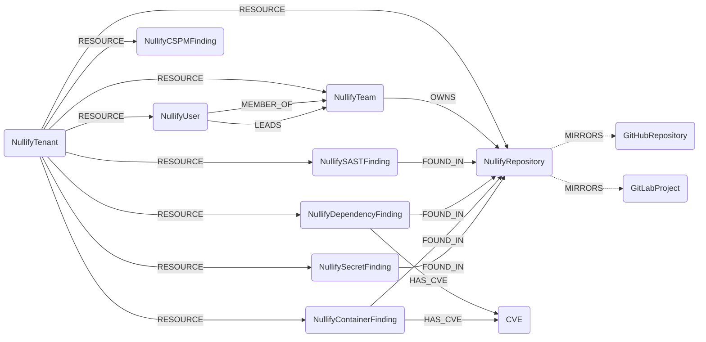

## Nullify Schema



Dotted edges are best-effort cross-module links, created only when the GitHub/GitLab node already exists in the graph (i.e. the source-control module has run). CSPM findings describe cloud-resource misconfigurations and are not tied to a repository.

### NullifyTenant

Represents a Nullify tenant, synthesized from the configured tenant slug (`https://api.<tenant>.nullify.ai`). It is the root node every other Nullify node hangs off.

> **Ontology Mapping**: This node has the extra label `Tenant` to enable cross-platform queries for organizational tenants across different systems (e.g. OktaOrganization, AzureTenant, GCPOrganization).

| Field | Description |
|-------|-------------|
| **id** | Tenant slug. |
| firstseen | Timestamp of when a sync job first created this node. |
| lastupdated | Timestamp of the last time the node was updated. |
| **name** | Tenant display name (defaults to the slug). |

### NullifyRepository

A repository tracked by Nullify, from `GET /admin/repositories`.

> **Ontology Mapping**: This node has the extra label `Asset`.

#### Relationships
- A repository belongs to its tenant.
    ```
    (:NullifyTenant)-[:RESOURCE]->(:NullifyRepository)
    ```
- A repository mirrors the source-control node it was ingested from (best-effort).
    ```
    (:NullifyRepository)-[:MIRRORS]->(:GitHubRepository)
    (:NullifyRepository)-[:MIRRORS]->(:GitLabProject)
    ```

| Field | Description |
|-------|-------------|
| **id** | Nullify repository id. |
| firstseen | Timestamp of when a sync job first created this node. |
| lastupdated | Timestamp of the last time the node was updated. |
| **repository_id** | Canonical repository identifier referenced by findings and teams. |
| **name** | Repository name. |
| owner | Owner (org/group/workspace) login. |
| owner_type | Owner type (e.g. `Organization`, `Group`). |
| platform | Source-control platform (`github`, `gitlab`, `bitbucket`, `azure`). |
| language | Primary language. |
| default_branch | Default branch name. |
| default_branch_committed_at | Timestamp of the latest commit on the default branch. |
| is_archived | Whether the repository is archived on its source platform. |
| is_enrolled | Whether the repository is enrolled in Nullify scanning. |

### NullifyTeam

A team defined in Nullify (from GitHub/Bitbucket ownership), from `GET /admin/teams`.

#### Relationships
- A team belongs to its tenant.
    ```
    (:NullifyTenant)-[:RESOURCE]->(:NullifyTeam)
    ```
- A team owns repositories.
    ```
    (:NullifyTeam)-[:OWNS]->(:NullifyRepository)
    ```
- Users are members of, and lead, teams.
    ```
    (:NullifyUser)-[:MEMBER_OF]->(:NullifyTeam)
    (:NullifyUser)-[:LEADS]->(:NullifyTeam)
    ```

| Field | Description |
|-------|-------------|
| **id** | Team id. |
| firstseen | Timestamp of when a sync job first created this node. |
| lastupdated | Timestamp of the last time the node was updated. |
| **name** | Team name. |
| **slug** | Team slug. |
| privacy | Team privacy (`closed`, `secret`, ...). |
| num_members | Member count. |

### NullifyUser

A user in the Nullify tenant, from `GET /admin/users`.

> **Ontology Mapping**: This node has the extra label `UserAccount`.

#### Relationships
- A user belongs to its tenant.
    ```
    (:NullifyTenant)-[:RESOURCE]->(:NullifyUser)
    ```

| Field | Description |
|-------|-------------|
| **id** | User id. |
| firstseen | Timestamp of when a sync job first created this node. |
| lastupdated | Timestamp of the last time the node was updated. |
| name | Display name. |
| **username** | Username. |
| **email** | Email address. |
| role | Nullify role (e.g. `builtin:admin`). |
| is_bot | Whether the account is a bot. |
| created_at | Account creation timestamp. |
| updated_at | Last-update timestamp. |

### NullifySASTFinding

A static code-analysis finding, from `GET /sast/findings`.

> **Ontology Mapping**: This node has the extra label `SecurityIssue`.

#### Relationships
- A finding belongs to its tenant and is found in a repository.
    ```
    (:NullifyTenant)-[:RESOURCE]->(:NullifySASTFinding)
    (:NullifySASTFinding)-[:FOUND_IN]->(:NullifyRepository)
    ```

| Field | Description |
|-------|-------------|
| **id** | Finding id. |
| firstseen | Timestamp of when a sync job first created this node. |
| lastupdated | Timestamp of the last time the node was updated. |
| **repository_id** | Repository the finding was raised in. |
| **rule_id** | Rule that produced the finding. |
| title | Finding title. |
| category | Finding category. |
| message | Finding message. |
| **severity** | Severity. |
| cwe | CWE number. |
| branch | Branch. |
| file_path | File path. |
| start_line | Start line. |
| end_line | End line. |
| priority_label | Nullify priority label. |
| priority_score | Nullify priority score. |
| is_resolved | Whether the finding is resolved. |
| is_false_positive | Whether the finding is marked as a false positive. |
| is_allowlisted | Whether the finding is allowlisted. |
| created_at | Creation timestamp. |
| updated_at | Last-update timestamp. |

### NullifyDependencyFinding

A vulnerable-dependency finding, from `GET /sca/dependencies/findings`.

> **Ontology Mapping**: This node has the extra label `SecurityIssue`.

#### Relationships
- A finding belongs to its tenant, is found in a repository, and references the CVEs affecting the dependency.
    ```
    (:NullifyTenant)-[:RESOURCE]->(:NullifyDependencyFinding)
    (:NullifyDependencyFinding)-[:FOUND_IN]->(:NullifyRepository)
    (:NullifyDependencyFinding)-[:HAS_CVE]->(:CVE)
    ```

| Field | Description |
|-------|-------------|
| **id** | Finding id. |
| firstseen | Timestamp of when a sync job first created this node. |
| lastupdated | Timestamp of the last time the node was updated. |
| **repository_id** | Repository the finding was raised in. |
| **package** | Affected package. |
| version | Installed version. |
| is_direct | Whether the dependency is direct. |
| suggested_version | Suggested safe version. |
| file_path | Dependency file path. |
| has_reachable_cves | Whether any linked CVE is reachable. |
| **max_severity** | Highest severity across linked vulnerabilities. |
| num_critical | Count of critical vulnerabilities. |
| num_high | Count of high vulnerabilities. |
| num_medium | Count of medium vulnerabilities. |
| num_low | Count of low vulnerabilities. |
| priority_label | Nullify priority label. |
| priority_score | Nullify priority score. |
| is_resolved | Whether the finding is resolved. |
| is_false_positive | Whether the finding is marked as a false positive. |
| is_allowlisted | Whether the finding is allowlisted. |
| created_at | Creation timestamp. |
| updated_at | Last-update timestamp. |

### NullifyContainerFinding

A vulnerable container-image finding, from `GET /sca/containers/findings`. Unlike a dependency finding, this is keyed on a container image (not a package): the affected image is captured from the finding's `imageMetadata`.

> **Ontology Mapping**: This node has the extra label `SecurityIssue`.

#### Relationships
    ```
    (:NullifyTenant)-[:RESOURCE]->(:NullifyContainerFinding)
    (:NullifyContainerFinding)-[:FOUND_IN]->(:NullifyRepository)
    (:NullifyContainerFinding)-[:HAS_CVE]->(:CVE)
    ```

| Field | Description |
|-------|-------------|
| **id** | Finding id. |
| firstseen | Timestamp of when a sync job first created this node. |
| lastupdated | Timestamp of the last time the node was updated. |
| **repository_id** | Repository the finding was raised in. |
| **image_reference** | Full image reference (`imageMetadata.fullReference`). |
| image_short_name | Image short name. |
| image_tag | Image tag. |
| **image_digest** | Image digest. |
| image_registry_domain | Registry domain. |
| title | Finding title. |
| file_path | Dockerfile path. |
| line | Line in the Dockerfile. |
| branch | Branch. |
| commit_hash | Commit hash. |
| **max_severity** | Highest severity across linked vulnerabilities. |
| num_critical | Count of critical vulnerabilities. |
| num_high | Count of high vulnerabilities. |
| num_medium | Count of medium vulnerabilities. |
| num_low | Count of low vulnerabilities. |
| num_unknown | Count of unknown-severity vulnerabilities. |
| is_auto_fixable | Whether Nullify can auto-fix the finding. |
| priority_label | Nullify priority label. |
| priority_score | Nullify priority score. |
| is_resolved | Whether the finding is resolved. |
| is_false_positive | Whether the finding is marked as a false positive. |
| is_allowlisted | Whether the finding is allowlisted. |
| created_at | Creation timestamp. |
| updated_at | Last-update timestamp. |

### NullifySecretFinding

A leaked secret/credential finding, from `GET /secrets/findings`. Only redacted values are stored; raw secrets are never ingested.

> **Ontology Mapping**: This node has the extra label `SecurityIssue`.

#### Relationships
    ```
    (:NullifyTenant)-[:RESOURCE]->(:NullifySecretFinding)
    (:NullifySecretFinding)-[:FOUND_IN]->(:NullifyRepository)
    ```

| Field | Description |
|-------|-------------|
| **id** | Finding id. |
| firstseen | Timestamp of when a sync job first created this node. |
| lastupdated | Timestamp of the last time the node was updated. |
| **repository_id** | Repository the finding was raised in. |
| **secret_type** | Type of secret detected. |
| redacted_secret | Redacted preview of the secret. |
| rule_id | Detection rule id. |
| entropy | Entropy score. |
| branch | Branch. |
| file_path | File path. |
| start_line | Start line. |
| end_line | End line. |
| author | Commit author. |
| commit | Commit hash. |
| priority_label | Nullify priority label. |
| is_false_positive | Whether the finding is marked as a false positive. |
| is_allowlisted | Whether the finding is allowlisted. |
| created_at | Creation timestamp. |
| updated_at | Last-update timestamp. |

### NullifyCSPMFinding

A cloud-security-posture misconfiguration finding, from `GET /cspm/findings`. These describe cloud resources, not repositories, so they hang off the tenant only.

> **Ontology Mapping**: This node has the extra label `SecurityIssue`.

#### Relationships
    ```
    (:NullifyTenant)-[:RESOURCE]->(:NullifyCSPMFinding)
    ```

| Field | Description |
|-------|-------------|
| **id** | Finding id. |
| firstseen | Timestamp of when a sync job first created this node. |
| lastupdated | Timestamp of the last time the node was updated. |
| **rule_id** | Rule that produced the finding. |
| title | Finding title. |
| category | Finding category. |
| **severity** | Severity. |
| **account_id** | Cloud account id the resource lives in. |
| account_name | Cloud account name. |
| cloud_provider | Cloud provider (`aws`, `gcp`, `azure`). |
| **resource_id** | Cloud resource id. |
| **resource_arn** | Cloud resource ARN. |
| resource_name | Cloud resource name. |
| resource_type | Cloud resource type. |
| region | Cloud region. |
| priority_label | Nullify priority label. |
| is_resolved | Whether the finding is resolved. |
| is_false_positive | Whether the finding is marked as a false positive. |
| is_allowlisted | Whether the finding is allowlisted. |
| created_at | Creation timestamp. |
| updated_at | Last-update timestamp. |
