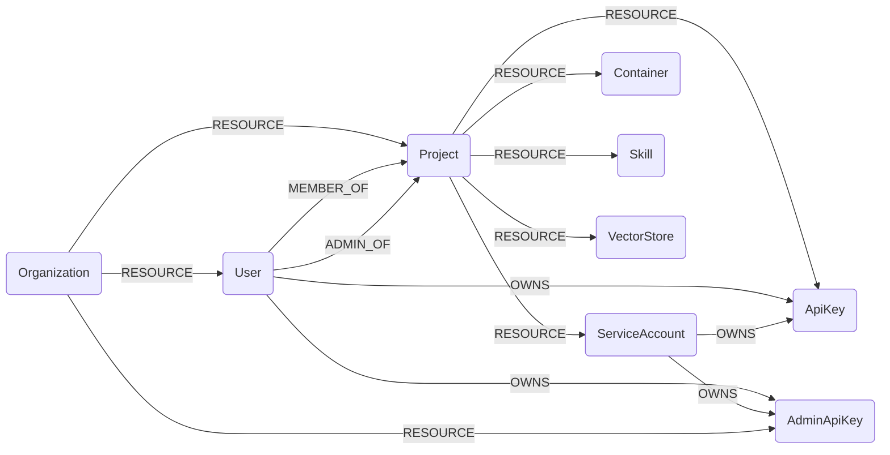

## OpenAI Schema




### OpenAIOrganization

Represents an OpenAI Organization.

> **Ontology Mapping**: This node has the extra label `Tenant` to enable cross-platform queries for organizational tenants across different systems (e.g., OktaOrganization, AWSAccount).

| Field | Description |
|-------|-------------|
| **id** | The identifier, which can be referenced in API endpoints |
| firstseen| Timestamp of when a sync job first created this node  |
| lastupdated |  Timestamp of the last time the node was updated |

#### Relationships
- Other resources belong to an `Organization`
    ```
    (OpenAIOrganization)-[:RESOURCE]->(
        :OpenAIAdminApiKey,
        :OpenAIUser,
        :OpenAIProject)
    ```


### OpenAIAdminApiKey

Represents an individual Admin API key in an org.

> **Ontology Mapping**: This node has the extra label `APIKey` to enable cross-platform queries for API keys across different systems (e.g., ScalewayAPIKey, AnthropicApiKey).

| Field | Description |
|-------|-------------|
| **id** | The identifier, which can be referenced in API endpoints |
| firstseen| Timestamp of when a sync job first created this node  |
| lastupdated |  Timestamp of the last time the node was updated |
| object | The object type, which is always `organization.admin_api_key` |
| name | The name of the API key |
| created_at | The Unix timestamp (in seconds) of when the API key was created |
| last_used_at | The Unix timestamp (in seconds) of when the API key was last used |


#### Relationships
- `Admin API Key` belongs to an `Organization`
    ```
    (OpenAIOrganization)-[:RESOURCE]->(OpenAIAdminApiKey)
    ```
- `Admin API Key` is owned by a `User` or a `ServiceAccount`
    ```
    (:OpenAIUser)-[:OWNS]->(:OpenAIAdminApiKey)
    (:OpenAIServiceAccount)-[:OWNS]->(:OpenAIAdminApiKey)
    ```

### OpenAIUser

Represents an individual `user` within an organization.

> **Ontology Mapping**: This node has the extra label `UserAccount` to enable cross-platform queries for user accounts across different systems (e.g., OktaUser, AWSSSOUser).

| Field | Description |
|-------|-------------|
| **id** | The identifier, which can be referenced in API endpoints |
| firstseen| Timestamp of when a sync job first created this node  |
| lastupdated |  Timestamp of the last time the node was updated |
| object | The object type, which is always `organization.user` |
| name | The name of the user |
| **email** | The email address of the user |
| role | `owner` or `reader` |
| added_at | The Unix timestamp (in seconds) of when the user was added. |

#### Relationships
- `User` belongs to an `Organization`
    ```
    (OpenAIOrganization)-[:RESOURCE]->(OpenAIAdminApiKey)
    ```
- `Admin API Key` is owned by a `User`
    ```
    (:OpenAIUser)-[:OWNS]->(:OpenAIAdminApiKey)
    ```
- `API Key` is owned by a `User`
    ```
    (:OpenAIUser)-[:OWNS]->(:OpenAIApiKey)
    ```
- `User` are member of a `Project`
    ```
    (:OpenAIUser)-[:MEMBER_OF]->(:OpenAIProject)
    ```
- `User` are admin of a `Project`
    ```
    (:OpenAIUser)-[:ADMIN_OF]->(:OpenAIProject)
    ```

### OpenAIProject

Represents an individual project.

> **Ontology Mapping**: This node has the extra label `Tenant` to enable cross-platform queries for organizational tenants across different systems (e.g., OktaOrganization, AWSAccount).

| Field | Description |
|-------|-------------|
| **id** | The identifier, which can be referenced in API endpoints |
| firstseen| Timestamp of when a sync job first created this node  |
| lastupdated |  Timestamp of the last time the node was updated |
| object | The object type, which is always `organization.project` |
| name | The name of the project. This appears in reporting. |
| created_at | The Unix timestamp (in seconds) of when the project was created. |
| archived_at | The Unix timestamp (in seconds) of when the project was archived or `null`. |
| status | `active` or `archived` |

#### Relationships
-  `ServiceAccount`, `APIKey`, `Container`, `Skill`, and `VectorStore` belong to an `OpenAIProject`.
    ```
    (:OpenAIProject)<-[:RESOURCE]-(
        :OpenAIServiceAccount,
        :OpenAIApiKey,
        :OpenAIContainer,
        :OpenAISkill,
        :OpenAIVectorStore,
    )
    ```
- `Project` belongs to an `Organization`
    ```
    (OpenAIOrganization)-[:RESOURCE]->(OpenAIProject)
    ```
- `User` are member of a `Project`
    ```
    (:OpenAIUser)-[:MEMBER_OF]->(:OpenAIProject)
    ```
- `User` are admin of a `Project`
    ```
    (:OpenAIUser)-[:ADMIN_OF]->(:OpenAIProject)
    ```

### OpenAIServiceAccount

Represents an individual service account in a project.

| Field | Description |
|-------|-------------|
| **id** | The identifier, which can be referenced in API endpoints |
| firstseen| Timestamp of when a sync job first created this node  |
| lastupdated |  Timestamp of the last time the node was updated |
| object | The object type, which is always `organization.project.service_account` |
| name | The name of the service account |
| role | `owner` or `member` |
| created_at | The Unix timestamp (in seconds) of when the service account was created |

#### Relationships
- `ServiceAccount` belongs to a `Project`
    ```
    (:OpenAIServiceAccount)-[:RESOURCE]->(:OpenAIProject)
    ```
- `Admin API Key` is owned by a `ServiceAccount`
    ```
    (:OpenAIServiceAccount)-[:OWNS]->(:OpenAIAdminApiKey)
    ```
- `API Key` is owned by a `ServiceAccount`
    ```
    (:OpenAIServiceAccount)-[:OWNS]->(:OpenAIApiKey)
    ```


### OpenAIApiKey

Represents an individual API key in a project.

> **Ontology Mapping**: This node has the extra label `APIKey` to enable cross-platform queries for API keys across different systems (e.g., ScalewayAPIKey, AnthropicApiKey).

| Field | Description |
|-------|-------------|
| **id** | The identifier, which can be referenced in API endpoints |
| firstseen| Timestamp of when a sync job first created this node  |
| lastupdated |  Timestamp of the last time the node was updated |
| object | The object type, which is always `organization.project.api_key` |
| name | The name of the API key |
| created_at | The Unix timestamp (in seconds) of when the API key was created |
| last_used_at | The Unix timestamp (in seconds) of when the API key was last used. |


#### Relationships
- `ApiKey` belongs to a `Project`
    ```
    (:OpenAIApiKey)-[:RESOURCE]->(:OpenAIProject)
    ```
- `APIKey` is owned by a `User` or a `ServiceAccount`
    ```
    (:OpenAIUser)-[:OWNS]->(:OpenAIApiKey)
    (:OpenAIServiceAccount)-[:OWNS]->(:OpenAIApiKey)
    ```

### OpenAIContainer

Represents a compute container in a project.

> **Ontology Mapping**: This node has the extra label `ComputeInstance` to enable cross-platform queries for compute resources across different systems (e.g., EC2Instance, GCPInstance).

| Field | Description |
|-------|-------------|
| **id** | The identifier, which can be referenced in API endpoints |
| firstseen| Timestamp of when a sync job first created this node  |
| lastupdated |  Timestamp of the last time the node was updated |
| object | The object type, which is always `container` |
| name | The name of the container |
| status | Status of the container (e.g., active, deleted) |
| created_at | The Unix timestamp (in seconds) of when the container was created |
| last_active_at | The Unix timestamp (in seconds) of when the container was last active |
| memory_limit | The memory limit configured for the container |

#### Relationships
- `Container` belongs to a `Project`
    ```
    (:OpenAIContainer)<-[:RESOURCE]-(:OpenAIProject)
    ```

### OpenAISkill

Represents a custom skill in a project.

| Field | Description |
|-------|-------------|
| **id** | The identifier, which can be referenced in API endpoints |
| firstseen| Timestamp of when a sync job first created this node  |
| lastupdated |  Timestamp of the last time the node was updated |
| object | The object type, which is always `skill` |
| name | The name of the skill |
| description | Description of the skill |
| created_at | The Unix timestamp (in seconds) of when the skill was created |
| default_version | The default version for the skill |
| latest_version | The latest version for the skill |

#### Relationships
- `Skill` belongs to a `Project`
    ```
    (:OpenAISkill)<-[:RESOURCE]-(:OpenAIProject)
    ```

### OpenAIVectorStore

Represents a vector store in a project.

> **Ontology Mapping**: This node has the extra label `Database` to enable cross-platform queries for data stores across different systems (e.g., AzureSQLDatabase, GCPBigtableInstance).

| Field | Description |
|-------|-------------|
| **id** | The identifier, which can be referenced in API endpoints |
| firstseen| Timestamp of when a sync job first created this node  |
| lastupdated |  Timestamp of the last time the node was updated |
| object | The object type, which is always `vector_store` |
| name | The name of the vector store |
| status | The status of the vector store (`expired`, `in_progress`, or `completed`) |
| created_at | The Unix timestamp (in seconds) of when the vector store was created |
| last_active_at | The Unix timestamp (in seconds) of when the vector store was last active |
| usage_bytes | The total number of bytes used by the files in the vector store |
| expires_at | The Unix timestamp (in seconds) of when the vector store will expire |

#### Relationships
- `VectorStore` belongs to a `Project`
    ```
    (:OpenAIVectorStore)<-[:RESOURCE]-(:OpenAIProject)
    ```
