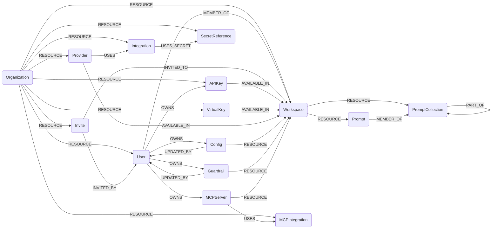

## Portkey Schema

### PortkeyOrganization

Represents a Portkey organization.

> **Ontology Mapping**: This node has the extra label `Tenant` to enable cross-platform tenant queries.

| Field | Description |
|-------|-------------|
| **id** | Portkey organization ID |
| lastupdated | Timestamp of the most recent sync |

#### Relationships
- `(PortkeyOrganization)-[:RESOURCE]->(:PortkeyUser)`
- `(PortkeyOrganization)-[:RESOURCE]->(:PortkeyWorkspace)`
- `(PortkeyOrganization)-[:RESOURCE]->(:PortkeyInvite)`
- `(PortkeyOrganization)-[:RESOURCE]->(:PortkeyAPIKey)`
- `(PortkeyOrganization)-[:RESOURCE]->(:PortkeyVirtualKey)`
- `(PortkeyOrganization)-[:RESOURCE]->(:PortkeyIntegration)`
- `(PortkeyOrganization)-[:RESOURCE]->(:PortkeyProvider)`
- `(PortkeyOrganization)-[:RESOURCE]->(:PortkeySecretReference)`
- `(PortkeyOrganization)-[:RESOURCE]->(:PortkeyMCPIntegration)`

### PortkeyUser

Represents an organization user in Portkey.

> **Ontology Mapping**: This node has the extra label `UserAccount` to enable cross-platform user-account queries.

| Field | Description |
|-------|-------------|
| **id** | Portkey user ID |
| email | User email address |
| first_name | User first name |
| last_name | User last name |
| role | Organization role |
| created_at | Creation timestamp |
| last_updated_at | Last update timestamp |

#### Relationships
- `(PortkeyOrganization)-[:RESOURCE]->(:PortkeyUser)`
- `(:PortkeyUser)-[:MEMBER_OF]->(:PortkeyWorkspace)`

### PortkeyWorkspace

Represents a Portkey workspace.

> **Ontology Mapping**: This node has the extra label `Tenant` to enable cross-platform tenant queries.

| Field | Description |
|-------|-------------|
| **id** | Workspace ID or slug |
| slug | Workspace slug |
| name | Workspace name |
| description | Workspace description |
| created_at | Creation timestamp |
| last_updated_at | Last update timestamp |

#### Relationships
- `(PortkeyOrganization)-[:RESOURCE]->(:PortkeyWorkspace)`
- `(:PortkeyInvite)-[:INVITED_TO]->(:PortkeyWorkspace)`
- `(:PortkeyAPIKey)-[:AVAILABLE_IN]->(:PortkeyWorkspace)`
- `(:PortkeyVirtualKey)-[:AVAILABLE_IN]->(:PortkeyWorkspace)`
- `(:PortkeyProvider)-[:AVAILABLE_IN]->(:PortkeyWorkspace)`
- `(:PortkeyWorkspace)-[:RESOURCE]->(:PortkeyConfig)`
- `(:PortkeyWorkspace)-[:RESOURCE]->(:PortkeyGuardrail)`
- `(:PortkeyWorkspace)-[:RESOURCE]->(:PortkeyPromptCollection)`
- `(:PortkeyWorkspace)-[:RESOURCE]->(:PortkeyPrompt)`
- `(:PortkeyWorkspace)-[:RESOURCE]->(:PortkeyMCPServer)`

### PortkeyInvite

Represents a pending, accepted, cancelled, or expired organization invite.

| Field | Description |
|-------|-------------|
| **id** | Invite ID |
| email | Invitee email |
| role | Invite role |
| status | Invite status |
| created_at | Creation timestamp |
| expires_at | Expiration timestamp |
| accepted_at | Acceptance timestamp |

#### Relationships
- `(PortkeyOrganization)-[:RESOURCE]->(:PortkeyInvite)`
- `(:PortkeyInvite)-[:INVITED_BY]->(:PortkeyUser)`
- `(:PortkeyInvite)-[:INVITED_TO]->(:PortkeyWorkspace)`

### PortkeyAPIKey

Represents an API key in Portkey.

> **Ontology Mapping**: This node has the extra label `APIKey` to enable cross-platform API key queries.

| Field | Description |
|-------|-------------|
| **id** | API key ID |
| name | Key name |
| type | Key type |
| status | Key status |
| scopes | Scope list |
| created_at | Creation timestamp |
| expires_at | Expiration timestamp |

#### Relationships
- `(PortkeyOrganization)-[:RESOURCE]->(:PortkeyAPIKey)`
- `(:PortkeyAPIKey)-[:AVAILABLE_IN]->(:PortkeyWorkspace)`
- `(:PortkeyUser)-[:OWNS]->(:PortkeyAPIKey)`

### PortkeyVirtualKey

Represents a virtual key in Portkey.

> **Ontology Mapping**: This node has the extra label `APIKey` to enable cross-platform API key queries.

| Field | Description |
|-------|-------------|
| **id** | Virtual key slug |
| name | Virtual key name |
| status | Virtual key status |
| created_at | Creation timestamp |
| expires_at | Expiration timestamp |

#### Relationships
- `(PortkeyOrganization)-[:RESOURCE]->(:PortkeyVirtualKey)`
- `(:PortkeyVirtualKey)-[:AVAILABLE_IN]->(:PortkeyWorkspace)`

### PortkeyConfig

Represents a workspace-scoped Portkey config.

| Field | Description |
|-------|-------------|
| **id** | Config ID |
| name | Config name |
| slug | Config slug |
| status | Config status |
| is_default | Default flag |

#### Relationships
- `(PortkeyWorkspace)-[:RESOURCE]->(:PortkeyConfig)`
- `(:PortkeyUser)-[:OWNS]->(:PortkeyConfig)`
- `(:PortkeyConfig)-[:UPDATED_BY]->(:PortkeyUser)`

### PortkeyIntegration

Represents an organization-scoped provider integration configured in Portkey.

| Field | Description |
|-------|-------------|
| **id** | Integration ID |
| ai_provider_id | Provider family identifier |
| name | Integration name |
| slug | Integration slug |
| status | Integration status |

#### Relationships
- `(PortkeyOrganization)-[:RESOURCE]->(:PortkeyIntegration)`
- `(:PortkeyIntegration)-[:USES_SECRET]->(:PortkeySecretReference)`

### PortkeyProvider

Represents an organization-scoped provider that can be made available to workspaces and is backed by an integration.

| Field | Description |
|-------|-------------|
| **id** | Provider slug |
| name | Provider name |
| integration_id | Backing integration ID |
| status | Provider status |

#### Relationships
- `(PortkeyOrganization)-[:RESOURCE]->(:PortkeyProvider)`
- `(:PortkeyProvider)-[:AVAILABLE_IN]->(:PortkeyWorkspace)`
- `(:PortkeyProvider)-[:USES]->(:PortkeyIntegration)`

### PortkeyGuardrail

Represents a workspace-scoped guardrail configured in Portkey.

| Field | Description |
|-------|-------------|
| **id** | Guardrail ID |
| name | Guardrail name |
| slug | Guardrail slug |
| status | Guardrail status |

#### Relationships
- `(PortkeyWorkspace)-[:RESOURCE]->(:PortkeyGuardrail)`
- `(:PortkeyUser)-[:OWNS]->(:PortkeyGuardrail)`
- `(:PortkeyGuardrail)-[:UPDATED_BY]->(:PortkeyUser)`

### PortkeyPromptCollection

Represents a prompt collection within a workspace.

| Field | Description |
|-------|-------------|
| **id** | Collection ID |
| name | Collection name |
| slug | Collection slug |
| parent_collection_id | Parent collection ID |
| status | Collection status |

#### Relationships
- `(PortkeyWorkspace)-[:RESOURCE]->(:PortkeyPromptCollection)`
- `(:PortkeyPromptCollection)-[:PART_OF]->(:PortkeyPromptCollection)`

### PortkeyPrompt

Represents a prompt in Portkey prompt management.

| Field | Description |
|-------|-------------|
| **id** | Prompt ID |
| name | Prompt name |
| slug | Prompt slug |
| model | Backing model |
| status | Prompt status |

#### Relationships
- `(PortkeyWorkspace)-[:RESOURCE]->(:PortkeyPrompt)`
- `(:PortkeyPrompt)-[:MEMBER_OF]->(:PortkeyPromptCollection)`

### PortkeySecretReference

Represents an external secret reference managed by Portkey.

| Field | Description |
|-------|-------------|
| **id** | Secret reference ID |
| name | Secret reference name |
| slug | Secret reference slug |
| manager_type | External secret-manager type |
| secret_path | Secret path in the backing manager |
| status | Secret reference status |

#### Relationships
- `(PortkeyOrganization)-[:RESOURCE]->(:PortkeySecretReference)`

### PortkeyMCPIntegration

Represents an organization-level MCP integration.

| Field | Description |
|-------|-------------|
| **id** | MCP integration ID |
| name | Integration name |
| type | Integration type |
| status | Integration status |
| url | Backing MCP integration URL |

#### Relationships
- `(PortkeyOrganization)-[:RESOURCE]->(:PortkeyMCPIntegration)`

### PortkeyMCPServer

Represents a workspace-scoped MCP server.

| Field | Description |
|-------|-------------|
| **id** | MCP server ID |
| name | MCP server name |
| slug | MCP server slug |
| status | MCP server status |
| url | MCP server URL |

#### Relationships
- `(PortkeyWorkspace)-[:RESOURCE]->(:PortkeyMCPServer)`
- `(:PortkeyUser)-[:OWNS]->(:PortkeyMCPServer)`
- `(:PortkeyMCPServer)-[:USES]->(:PortkeyMCPIntegration)`
