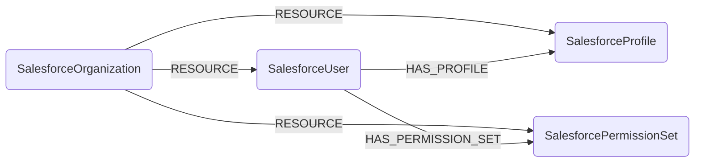

## Salesforce Schema



### SalesforceOrganization

Represents a Salesforce organization (tenant).

> **Ontology Mapping**: This node has the extra label `Tenant` to enable cross-platform queries for organizational tenants across different systems (e.g., OktaOrganization, AWSAccount).

| Field | Description |
|-------|-------------|
| **id** | The 18-character Salesforce Organization ID |
| firstseen | Timestamp of when a sync job first created this node |
| lastupdated | Timestamp of the last time the node was updated |
| name | The organization's name |
| instance_name | The Salesforce instance the org is hosted on |
| organization_type | The org edition (e.g. `Enterprise Edition`) |
| is_sandbox | Whether the org is a sandbox |

#### Relationships
- People and permission resources belong to a `SalesforceOrganization`
    ```
    (:SalesforceOrganization)-[:RESOURCE]->(
        :SalesforceUser,
        :SalesforceProfile,
        :SalesforcePermissionSet)
    ```

### SalesforceUser

Represents a Salesforce user.

> **Ontology Mapping**: This node has the extra label `UserAccount` to enable cross-platform queries for user accounts across different systems (e.g., OktaUser, AWSSSOUser).

| Field | Description |
|-------|-------------|
| **id** | The 18-character Salesforce User ID |
| firstseen | Timestamp of when a sync job first created this node |
| lastupdated | Timestamp of the last time the node was updated |
| **username** | The user's username (login) |
| **email** | The user's email address |
| name | The user's display name |
| is_active | Whether the user is active |
| user_type | The user's type (e.g. `Standard`) |
| profile_id | The ID of the user's profile |

#### Relationships
- A `SalesforceUser` belongs to a `SalesforceOrganization`
    ```
    (:SalesforceOrganization)-[:RESOURCE]->(:SalesforceUser)
    ```
- A `SalesforceUser` has exactly one `SalesforceProfile`
    ```
    (:SalesforceUser)-[:HAS_PROFILE]->(:SalesforceProfile)
    ```
- A `SalesforceUser` is assigned zero or more standalone `SalesforcePermissionSet`
    ```
    (:SalesforceUser)-[:HAS_PERMISSION_SET]->(:SalesforcePermissionSet)
    ```

### SalesforceProfile

Represents a Salesforce profile: the base bundle of permissions assigned to a user. Every user has exactly one profile.

> **Ontology Mapping**: This node has the extra label `PermissionRole` to enable cross-platform queries for permission bundles across different systems (e.g., WorkOSRole).

| Field | Description |
|-------|-------------|
| **id** | The 18-character Salesforce Profile ID |
| firstseen | Timestamp of when a sync job first created this node |
| lastupdated | Timestamp of the last time the node was updated |
| **name** | The profile's name |
| user_type | The user license type associated with the profile |

#### Relationships
- A `SalesforceProfile` belongs to a `SalesforceOrganization`
    ```
    (:SalesforceOrganization)-[:RESOURCE]->(:SalesforceProfile)
    ```
- A `SalesforceUser` has a `SalesforceProfile`
    ```
    (:SalesforceUser)-[:HAS_PROFILE]->(:SalesforceProfile)
    ```

### SalesforcePermissionSet

Represents a standalone Salesforce permission set: an additive bundle of permissions assigned to users on top of their profile. Profile-owned permission sets are not synced as nodes.

> **Ontology Mapping**: This node has the extra label `PermissionRole` to enable cross-platform queries for permission bundles across different systems (e.g., WorkOSRole).

| Field | Description |
|-------|-------------|
| **id** | The 18-character Salesforce PermissionSet ID |
| firstseen | Timestamp of when a sync job first created this node |
| lastupdated | Timestamp of the last time the node was updated |
| **name** | The permission set's API name |
| label | The permission set's user-facing label |
| type | The permission set's type |
| is_owned_by_profile | Whether the permission set is owned by a profile (always `false` for synced nodes) |

#### Relationships
- A `SalesforcePermissionSet` belongs to a `SalesforceOrganization`
    ```
    (:SalesforceOrganization)-[:RESOURCE]->(:SalesforcePermissionSet)
    ```
- A `SalesforceUser` is assigned a `SalesforcePermissionSet`
    ```
    (:SalesforceUser)-[:HAS_PERMISSION_SET]->(:SalesforcePermissionSet)
    ```
