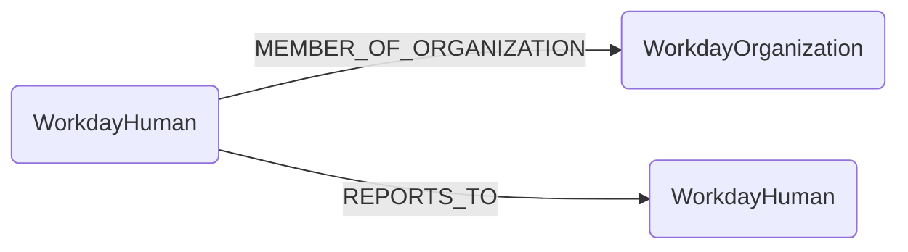

## Workday Schema



### WorkdayHuman

Representation of a person in the Workday system. WorkdayHuman nodes are also labeled as `Human` to enable integration with other identity modules (Duo, Okta, etc.) via email matching.

| Field | Description |
|-------|-------------|
| firstseen| Timestamp of when a sync job first created this node  |
| lastupdated |  Timestamp of the last time the node was updated |
| **id** | Employee ID from Workday (e.g., `emp001`) |
| **employee_id** | Same as id - Employee ID (indexed for fast lookups) |
| **name** | Employee's full name |
| **email** | Work email address (indexed for cross-module relationships) |
| **title** | Job title/business title |
| **worker_type** | Type of worker (e.g., Employee, Contractor) |
| **location** | Office or work location |
| **country** | Country from work address |
| **cost_center** | Cost center code |
| **function** | Functional area (e.g., Product Development, Engineering) |
| **sub_function** | Sub-functional area |
| **team** | Team name |
| **sub_team** | Sub-team name |
| **company** | Company or legal entity name |
| **source** | Always set to `"WORKDAY"` to identify the data source |

#### Relationships

- WorkdayHumans are members of WorkdayOrganizations

    ```
    (WorkdayHuman)-[MEMBER_OF_ORGANIZATION]->(WorkdayOrganization)
    ```

- WorkdayHumans report to other WorkdayHumans (manager hierarchy)

    ```
    (WorkdayHuman)-[REPORTS_TO]->(WorkdayHuman)
    ```

#### Human Label Integration

WorkdayHuman nodes are also labeled as `Human`, enabling integration with other identity sources:

```cypher
// Find a person's Duo and Workday identities
MATCH (h:Human {email: "alice@example.com"})
OPTIONAL MATCH (h)-[:IDENTITY_DUO]-(duo:DuoUser)
OPTIONAL MATCH (h:WorkdayHuman)
RETURN h.name, h.email, duo.username, h.title
```

### WorkdayOrganization

Representation of a supervisory organization or department in Workday.

| Field | Description |
|-------|-------------|
| firstseen| Timestamp of when a sync job first created this node  |
| lastupdated |  Timestamp of the last time the node was updated |
| **id** | Organization name (e.g., `Engineering Department`) |
| **name** | Organization name |

#### Relationships

- WorkdayHumans are members of WorkdayOrganizations

    ```
    (WorkdayHuman)-[MEMBER_OF_ORGANIZATION]->(WorkdayOrganization)
    ```

## Sample Cypher Queries

### Find all employees in an organization

```cypher
MATCH (h:WorkdayHuman)-[:MEMBER_OF_ORGANIZATION]->(o:WorkdayOrganization {name: "Engineering Department"})
RETURN h.name, h.email, h.title
ORDER BY h.name
```

### Find an employee's manager chain

```cypher
MATCH path = (h:WorkdayHuman {email: "alice@example.com"})-[:REPORTS_TO*]->(manager:WorkdayHuman)
RETURN [node in nodes(path) | node.name] as reporting_chain
```

### Find direct reports for a manager

```cypher
MATCH (report:WorkdayHuman)-[:REPORTS_TO]->(manager:WorkdayHuman {email: "manager@example.com"})
RETURN report.name, report.email, report.title
ORDER BY report.name
```

### Count employees by organization

```cypher
MATCH (h:WorkdayHuman)-[:MEMBER_OF_ORGANIZATION]->(o:WorkdayOrganization)
RETURN o.name, count(h) as employee_count
ORDER BY employee_count DESC
```

### Find employees by function

```cypher
MATCH (h:WorkdayHuman)
WHERE h.function = "Product Development"
RETURN h.name, h.sub_function, h.team
ORDER BY h.team, h.name
```

### Find contractors vs employees

```cypher
MATCH (h:WorkdayHuman)
RETURN h.worker_type, count(h) as count
ORDER BY count DESC
```

### Find employees in a specific location

```cypher
MATCH (h:WorkdayHuman)
WHERE h.location CONTAINS "San Francisco"
RETURN h.name, h.team, h.title
ORDER BY h.team
```

### Find managers (people with direct reports)

```cypher
MATCH (h:WorkdayHuman)<-[:REPORTS_TO]-(report:WorkdayHuman)
WITH h, count(report) as report_count
WHERE report_count > 0
RETURN h.name, h.title, report_count
ORDER BY report_count DESC
```

### Cross-module: Find Workday employees with Duo accounts

```cypher
MATCH (h:WorkdayHuman)
MATCH (duo:DuoUser {email: h.email})
MATCH (h2:Human)-[:IDENTITY_DUO]->(duo)
RETURN h.name, h.email, duo.is_enrolled as duo_enrolled
```

### Find organization hierarchy

```cypher
MATCH (h:WorkdayHuman)-[:MEMBER_OF_ORGANIZATION]->(o:WorkdayOrganization)
WITH o, count(h) as members
RETURN o.name, members
ORDER BY members DESC
```

### Find employees without managers

```cypher
MATCH (h:WorkdayHuman)
WHERE NOT (h)-[:REPORTS_TO]->(:WorkdayHuman)
RETURN h.name, h.title, h.email
```

### Map team structure

```cypher
MATCH (h:WorkdayHuman)
WHERE h.team IS NOT NULL
RETURN DISTINCT h.team, h.sub_team, count(*) as members
ORDER BY h.team, h.sub_team
```
