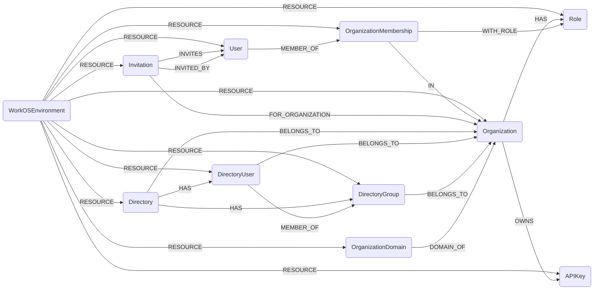

## WorkOS Schema




### WorkOSEnvironment

Represents a WorkOS Environment (root node for a WorkOS account/client). This is the top-level node that all other WorkOS resources are connected to.

> **Ontology Mapping**: This node has the extra label `Tenant` to enable cross-platform queries for organizational tenants across different systems (e.g., OktaOrganization, AzureTenant, GCPOrganization).


| Field | Description |
|-------|-------------|
| id | The WorkOS client ID |
| firstseen| Timestamp of when a sync job first created this node  |
| lastupdated |  Timestamp of the last time the node was updated |

#### Relationships
- All WorkOS resources belong to an `Environment`
    ```
    (WorkOSEnvironment)-[:RESOURCE]->(
        :WorkOSOrganization,
        :WorkOSUser,
        :WorkOSDirectory,
        :WorkOSRole,
        :WorkOSInvitation,
        :WorkOSOrganizationMembership,
        :WorkOSDirectoryUser,
        :WorkOSDirectoryGroup,
        :WorkOSOrganizationDomain,
        :WorkOSAPIKey)
    ```


### WorkOSOrganization

Represents a WorkOS Organization. Organizations are the primary tenant unit in WorkOS and can contain multiple users, directories, and other resources.

**Ontology Labels**: `Tenant`

| Field | Description |
|-------|-------------|
| id | The identifier, which can be referenced in API endpoints |
| firstseen| Timestamp of when a sync job first created this node  |
| lastupdated |  Timestamp of the last time the node was updated |
| name | The name of the organization |
| created_at | The RFC 3339 datetime of when the organization was created |
| updated_at | The RFC 3339 datetime of when the organization was last updated |
| allow_profiles_outside_organization | Whether profiles outside the organization are allowed |

#### Relationships
- `Organization` belongs to an `Environment`
    ```
    (WorkOSEnvironment)-[:RESOURCE]->(WorkOSOrganization)
    ```
- `Organization` has `Roles`
    ```
    (WorkOSOrganization)-[:HAS]->(WorkOSRole)
    ```


### WorkOSUser

Represents an individual user in WorkOS. Users can be members of multiple organizations and have authentication profiles.

> **Ontology Mapping**: This node has the extra label `UserAccount` to enable cross-platform queries for user accounts across different systems (e.g., OktaUser, EntraUser, GitHubUser).

| Field | Description |
|-------|-------------|
| id | The identifier, which can be referenced in API endpoints |
| firstseen| Timestamp of when a sync job first created this node  |
| lastupdated |  Timestamp of the last time the node was updated |
| email | The email address of the user |
| first_name | The first name of the user |
| last_name | The last name of the user |
| email_verified | Whether the email address has been verified |
| profile_picture_url | URL to the user's profile picture |
| last_sign_in_at | The RFC 3339 datetime of the user's last sign-in |
| created_at | The RFC 3339 datetime of when the user was created |
| updated_at | The RFC 3339 datetime of when the user was last updated |

#### Relationships
- `User` belongs to an `Environment`
    ```
    (WorkOSEnvironment)-[:RESOURCE]->(WorkOSUser)
    ```
- `User` is member of `OrganizationMembership`
    ```
    (WorkOSUser)-[:MEMBER_OF]->(WorkOSOrganizationMembership)
    ```
- `User` can be invited by `Invitation`
    ```
    (WorkOSInvitation)-[:INVITES]->(WorkOSUser)
    ```
- `User` can create `Invitation`
    ```
    (WorkOSInvitation)-[:INVITED_BY]->(WorkOSUser)
    ```


### WorkOSOrganizationMembership

Represents a user's membership in an organization. This links users to organizations and defines their roles within the organization.

| Field | Description |
|-------|-------------|
| id | The identifier, which can be referenced in API endpoints |
| firstseen| Timestamp of when a sync job first created this node  |
| lastupdated |  Timestamp of the last time the node was updated |
| user_id | The ID of the user |
| organization_id | The ID of the organization |
| status | The status of the membership (e.g., active, pending) |
| role_id | The ID of the role assigned to the user |
| created_at | The RFC 3339 datetime of when the membership was created |
| updated_at | The RFC 3339 datetime of when the membership was last updated |

#### Relationships
- `OrganizationMembership` belongs to an `Environment`
    ```
    (WorkOSEnvironment)-[:RESOURCE]->(WorkOSOrganizationMembership)
    ```
- `User` is member of `OrganizationMembership`
    ```
    (WorkOSUser)-[:MEMBER_OF]->(WorkOSOrganizationMembership)
    ```
- `OrganizationMembership` is in `Organization`
    ```
    (WorkOSOrganizationMembership)-[:IN]->(WorkOSOrganization)
    ```
- `OrganizationMembership` has `Role`
    ```
    (WorkOSOrganizationMembership)-[:WITH_ROLE]->(WorkOSRole)
    ```


### WorkOSRole

Represents a role within an organization. Roles define permissions and access levels for users.

| Field | Description |
|-------|-------------|
| id | The identifier, which can be referenced in API endpoints |
| firstseen| Timestamp of when a sync job first created this node  |
| lastupdated |  Timestamp of the last time the node was updated |
| slug | A unique slug identifier for the role |
| name | The name of the role |
| description | A description of the role |
| type | The type of the role (e.g., environment, organization) |
| organization_id | The ID of the organization this role belongs to |
| created_at | The RFC 3339 datetime of when the role was created |
| updated_at | The RFC 3339 datetime of when the role was last updated |

#### Relationships
- `Role` belongs to an `Environment`
    ```
    (WorkOSEnvironment)-[:RESOURCE]->(WorkOSRole)
    ```
- `Organization` has `Role`
    ```
    (WorkOSOrganization)-[:HAS]->(WorkOSRole)
    ```


### WorkOSInvitation

Represents an invitation to join an organization. Invitations are sent to users to join specific organizations.

| Field | Description |
|-------|-------------|
| id | The identifier, which can be referenced in API endpoints |
| firstseen| Timestamp of when a sync job first created this node  |
| lastupdated |  Timestamp of the last time the node was updated |
| email | The email address of the invited user |
| state | The state of the invitation (e.g., pending, accepted, expired) |
| organization_id | The ID of the organization the user is invited to |
| inviter_user_id | The ID of the user who sent the invitation |
| token | The invitation token |
| accept_invitation_url | The URL to accept the invitation |
| expires_at | The RFC 3339 datetime when the invitation expires |
| created_at | The RFC 3339 datetime of when the invitation was created |
| updated_at | The RFC 3339 datetime of when the invitation was last updated |
| accepted_at | The RFC 3339 datetime of when the invitation was accepted |
| revoked_at | The RFC 3339 datetime of when the invitation was revoked |

#### Relationships
- `Invitation` belongs to an `Environment`
    ```
    (WorkOSEnvironment)-[:RESOURCE]->(WorkOSInvitation)
    ```
- `Invitation` is for `Organization`
    ```
    (WorkOSInvitation)-[:FOR_ORGANIZATION]->(WorkOSOrganization)
    ```
- `Invitation` invites `User`
    ```
    (WorkOSInvitation)-[:INVITES]->(WorkOSUser)
    ```
- `Invitation` was created by `User`
    ```
    (WorkOSInvitation)-[:INVITED_BY]->(WorkOSUser)
    ```


### WorkOSDirectory

Represents a directory sync connection. Directories are used to sync users and groups from external identity providers (e.g., Google Workspace, Okta, Azure AD).

| Field | Description |
|-------|-------------|
| id | The identifier, which can be referenced in API endpoints |
| firstseen| Timestamp of when a sync job first created this node  |
| lastupdated |  Timestamp of the last time the node was updated |
| name | The name of the directory |
| domain | The domain associated with the directory |
| state | The state of the directory (e.g., linked, unlinked) |
| type | The type of identity provider (e.g., gsuite, okta, azure) |
| organization_id | The ID of the organization this directory belongs to |
| created_at | The RFC 3339 datetime of when the directory was created |
| updated_at | The RFC 3339 datetime of when the directory was last updated |

#### Relationships
- `Directory` belongs to an `Environment`
    ```
    (WorkOSEnvironment)-[:RESOURCE]->(WorkOSDirectory)
    ```
- `Directory` belongs to `Organization`
    ```
    (WorkOSDirectory)-[:BELONGS_TO]->(WorkOSOrganization)
    ```
- `Directory` has `DirectoryUser`
    ```
    (WorkOSDirectory)-[:HAS]->(WorkOSDirectoryUser)
    ```
- `Directory` has `DirectoryGroup`
    ```
    (WorkOSDirectory)-[:HAS]->(WorkOSDirectoryGroup)
    ```


### WorkOSDirectoryUser

Represents a user synced from an external directory. These are different from WorkOSUser objects and represent users from identity providers.

**Ontology Labels**: `UserAccount`

| Field | Description |
|-------|-------------|
| id | The identifier, which can be referenced in API endpoints |
| firstseen| Timestamp of when a sync job first created this node  |
| lastupdated |  Timestamp of the last time the node was updated |
| idp_id | The identifier from the identity provider |
| directory_id | The ID of the directory this user belongs to |
| organization_id | The ID of the organization this user belongs to |
| first_name | The first name of the user |
| last_name | The last name of the user |
| email | The email address of the user |
| state | The state of the directory user (e.g., active, inactive) |
| created_at | The RFC 3339 datetime of when the directory user was created |
| updated_at | The RFC 3339 datetime of when the directory user was last updated |
| custom_attributes | Custom attributes from the identity provider |
| raw_attributes | Raw attributes from the identity provider |
| role | The role of the user in the directory |

#### Relationships
- `DirectoryUser` belongs to an `Environment`
    ```
    (WorkOSEnvironment)-[:RESOURCE]->(WorkOSDirectoryUser)
    ```
- `Directory` has `DirectoryUser`
    ```
    (WorkOSDirectory)-[:HAS]->(WorkOSDirectoryUser)
    ```
- `DirectoryUser` belongs to `Organization`
    ```
    (WorkOSDirectoryUser)-[:BELONGS_TO]->(WorkOSOrganization)
    ```
- `DirectoryUser` is member of `DirectoryGroup`
    ```
    (WorkOSDirectoryUser)-[:MEMBER_OF]->(WorkOSDirectoryGroup)
    ```


### WorkOSDirectoryGroup

Represents a group synced from an external directory. Groups contain directory users and represent organizational units from identity providers.

| Field | Description |
|-------|-------------|
| id | The identifier, which can be referenced in API endpoints |
| firstseen| Timestamp of when a sync job first created this node  |
| lastupdated |  Timestamp of the last time the node was updated |
| idp_id | The identifier from the identity provider |
| name | The name of the group |
| created_at | The RFC 3339 datetime of when the directory group was created |
| updated_at | The RFC 3339 datetime of when the directory group was last updated |
| raw_attributes | Raw attributes from the identity provider |

#### Relationships
- `DirectoryGroup` belongs to an `Environment`
    ```
    (WorkOSEnvironment)-[:RESOURCE]->(WorkOSDirectoryGroup)
    ```
- `Directory` has `DirectoryGroup`
    ```
    (WorkOSDirectory)-[:HAS]->(WorkOSDirectoryGroup)
    ```
- `DirectoryGroup` belongs to `Organization`
    ```
    (WorkOSDirectoryGroup)-[:BELONGS_TO]->(WorkOSOrganization)
    ```


### WorkOSOrganizationDomain

Represents a domain verified for an organization. Domains are used to verify ownership of email domains and can be used for automatic user assignment.

| Field | Description |
|-------|-------------|
| id | The identifier, which can be referenced in API endpoints |
| firstseen| Timestamp of when a sync job first created this node  |
| lastupdated |  Timestamp of the last time the node was updated |
| domain | The domain name (e.g., example.com) |
| organization_id | The ID of the organization this domain belongs to |
| state | The verification state of the domain (e.g., verified, pending) |
| verification_strategy | The strategy used to verify the domain |
| verification_token | The token used for domain verification |

#### Relationships
- `OrganizationDomain` belongs to an `Environment`
    ```
    (WorkOSEnvironment)-[:RESOURCE]->(WorkOSOrganizationDomain)
    ```
- `OrganizationDomain` is domain of `Organization`
    ```
    (WorkOSOrganizationDomain)-[:DOMAIN_OF]->(WorkOSOrganization)
    ```


### WorkOSAPIKey

Represents an API key used for programmatic access to WorkOS resources.

**Note**: API key sync is currently not enabled in the ingestion module (Work In Progress).

> **Ontology Mapping**: This node has the extra label `APIKey` to enable cross-platform queries for API keys across different systems (e.g., OpenAIApiKey, ScalewayAPIKey).

| Field | Description |
|-------|-------------|
| id | The identifier, which can be referenced in API endpoints |
| firstseen| Timestamp of when a sync job first created this node  |
| lastupdated |  Timestamp of the last time the node was updated |
| name | The name of the API key |
| obfuscated_value | The obfuscated/partial API key value |
| permissions | The permissions granted to this API key |
| created_at | The RFC 3339 datetime of when the API key was created |
| updated_at | The RFC 3339 datetime of when the API key was last updated |
| last_used_at | The RFC 3339 datetime of when the API key was last used |

#### Relationships
- `APIKey` belongs to an `Environment`
    ```
    (WorkOSEnvironment)-[:RESOURCE]->(WorkOSAPIKey)
    ```
- `Organization` owns `APIKey`
    ```
    (WorkOSOrganization)-[:OWNS]->(WorkOSAPIKey)
    ```
- `User` owns `APIKey`
    ```
    (WorkOSUser)-[:OWNS]->(WorkOSAPIKey)
    ```


### WorkOSApplication

Represents an OAuth/OIDC application integrated with WorkOS. These can be OAuth applications or Machine-to-Machine (M2M) applications.

**Note**: Application sync is currently not enabled in the ingestion module (Work In Progress).

> **Ontology Mapping**: This node has the extra label `ThirdPartyApp` to enable cross-platform queries for OAuth/SAML applications across different systems (e.g., OktaApplication, KeycloakClient).


| Field | Description |
|-------|-------------|
| id | The identifier, which can be referenced in API endpoints |
| firstseen| Timestamp of when a sync job first created this node  |
| lastupdated |  Timestamp of the last time the node was updated |
| client_id | The OAuth client ID for the application |
| name | The name of the application |
| description | A description of the application |
| application_type | The type of application (oauth or m2m) |
| redirect_uris | List of allowed redirect URIs for OAuth flows |
| uses_pkce | Whether the application uses PKCE (Proof Key for Code Exchange) |
| is_first_party | Whether this is a first-party application |
| was_dynamically_registered | Whether the application was dynamically registered |
| scopes | The OAuth scopes granted to this application |
| created_at | The RFC 3339 datetime of when the application was created |
| updated_at | The RFC 3339 datetime of when the application was last updated |

#### Relationships
- `Application` belongs to an `Environment`
    ```
    (WorkOSEnvironment)-[:RESOURCE]->(WorkOSApplication)
    ```
- `Application` belongs to `Organization`
    ```
    (WorkOSApplication)-[:BELONGS_TO]->(WorkOSOrganization)
    ```

### WorkOSAPIKey

Represents a WorkOS API Key used to authenticate API requests.

**Ontology Labels**: `APIKey`

| Field | Description |
|-------|-------------|
| id | The identifier, which can be referenced in API endpoints |
| firstseen| Timestamp of when a sync job first created this node  |
| lastupdated |  Timestamp of the last time the node was updated |
| name | The name of the API key |
| obfuscated_value | The obfuscated value of the API key |
| permissions | JSON-encoded list of permissions granted to this key |
| created_at | The RFC 3339 datetime of when the API key was created |
| updated_at | The RFC 3339 datetime of when the API key was last updated |
| last_used_at | The RFC 3339 datetime of when the API key was last used |

#### Relationships
- `APIKey` belongs to an `Environment`
    ```
    (WorkOSEnvironment)-[:RESOURCE]->(WorkOSAPIKey)
    ```
- `APIKey` is owned by an `Organization`
    ```
    (WorkOSOrganization)-[:OWNS]->(WorkOSAPIKey)
    ```
- `APIKey` is owned by a `User`
    ```
    (WorkOSUser)-[:OWNS]->(WorkOSAPIKey)
    ```
