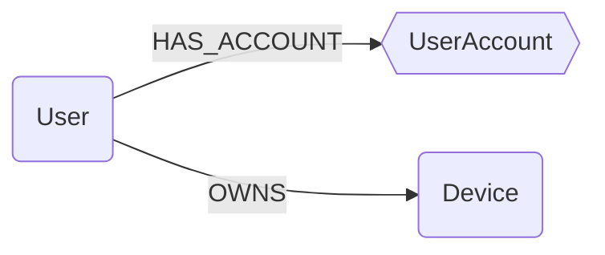

# Ontology in Cartography

## What is an Ontology?

An ontology is a structured representation of concepts and relationships within a given domain. It enables semantic modeling of knowledge, making it easier to organize, analyze, and query data. In Cartography, the ontology defines entity (node) types and their relationships, using semantic labels and abstract nodes for better interoperability and extensibility.

A key benefit of this approach is that it enables cross-module queries and the export of data in a unified format. By providing a common semantic layer, different modules can interact seamlessly, and data from various sources can be normalized and exported consistently.

### Implementation in Cartography

Cartography implements ontology using two main concepts:
- **Semantic Label**: Each graph node can have one or more semantic labels describing its nature (e.g., `UserAccount`, `DNSRecord`).
- **Abstract Nodes**: Some nodes serve as abstract concepts to group similar entities or define common behaviors. This allows logic to be factored and ensures model consistency.

:::{seealso}
For more background and design rationale, see:
- [Unifying the Graph: Why We Introduced an Ontology in Cartography](https://medium.com/@jychp/unifying-the-graph-why-we-introduced-an-ontology-in-cartography-33b9301de22d)
- [RFC: Cartography Ontology Schema](https://github.com/cartography-cncf/cartography/discussions/1579)
:::

## How Ontology Works in Cartography

The `intel.ontology` module in Cartography manages ontology logic. It allows:
- Loading ontology definitions from JSON files
- Validating the consistency of entities and relationships
- Ensuring mapping between collected data and the defined semantic model

The module provides functions to traverse, enrich, and leverage the ontology during data ingestion. It plays a key role in normalizing entities from heterogeneous sources.

Some nodes, such as IP addresses, are created regardless of the data source, ensuring that common entities always exist in the graph. However, other nodes—such as `User`—are only created by modules that are explicitly listed as a source of truth.

**Example: User Nodes and Source of Truth**

If you set the `--ontology-users-source` parameter to `duo`, then a `User` node will be created for every account found in Duo. In contrast, for other integrations like Tailscale, only existing `User` nodes (those created by the source of truth) will be linked to Tailscale accounts. No new `User` nodes will be created from Tailscale data alone.

## Structure of Ontology JSON Files

Ontology files are located in `cartography/data/ontology/`. They use a structure like the following:

```json
{
    "module": {
        "nodes": {
            "NodeName": {
                "ontology_field": "corresponding_field_in_module_node"
            }
        },
        "rels": [
            {
                "__comment__": "These relationships are used to build links between ontology nodes to reflect observed nodes in the modules.",
                "query": "MATCH (u:User)-[:HAS_ACCOUNT]->(:TailscaleUser)-[:OWNS]-(:TailscaleDevice)<-[:HAS_OBSERVATION]-(d:Device) MERGE (u)-[r:OWNS]->(d) ON CREATE SET r.firstseen = timestamp() SET r.lastupdated = $UPDATE_TAG",
                "iterative": false
            }
        ]
    }
}
```

- The top-level key (e.g., `tailscale`) groups integration-specific logic.
- The `nodes` section defines node types and their property mappings (this mapping is only used for ingestion).
- The `rels` section lists Cypher queries to connect nodes based on observed data.

This structure allows Cartography to flexibly describe how to map and relate entities from specific integrations into the unified ontology graph.

## Ontology Schema Documentation

The ontology schema is defined in `cartography/models/ontology`.



:::{note}
In this schema, `squares` represent `Abstract Nodes` and `hexagons` represent `Semantic Labels` (on module nodes).
:::

### Semantic Labels

| **Name** | **Description** | **Ref** |
| -------- | --------------- | ------- |
| UserAccount | Represents a user account on a system or service. This label is used to unify accounts from different sources (e.g., Duo, Okta, Tailscale). | [d3f:UserAccount](https://d3fend.mitre.org/dao/artifact/d3f:UserAccount/) |

### User

_Reference: [d3f:User](https://d3fend.mitre.org/dao/artifact/d3f:User/)_

A user is a person (or agent) who uses a computer or network service.
A user often has one or many user accounts.

| Field | Description |
|-------|-------------|
| id | The unique identifier for the user. |
| firstseen | Timestamp of when a sync job first created this node. |
| lastupdated | Timestamp of the last time the node was updated. |
| email | User's primary email. |
| username | Login of the user in the main IDP. |
| fullname | User's full name. |
| firstname | User's first name. |
| lastname | User's last name. |

#### Relationships

- `User` has one or many `UserAccount` (semantic label):
    ```
    (:User)-[:HAS_ACCOUNT]->(:UserAccount)
    ```
- `User` can own one or many `Device`:
    ```
    (:User)-[:OWNS]->(:Device)
    ```

### Device

_Reference: [d3f:ClientComputer](https://d3fend.mitre.org/dao/artifact/d3f:ClientComputer/)_

A client computer is a host that accesses a service made available by a server or a third party provider.
A client computer can be a `DesktopComputer`, `LaptopComputer`, `TableComputer`, `MobilePhone`.

| Field | Description |
|-------|-------------|
| id | The unique identifier for the user. |
| firstseen | Timestamp of when a sync job first created this node. |
| lastupdated | Timestamp of the last time the node was updated. |
| hostname | Hostname of the device. |
| os | OS running on the device. |
| os_version | Version of the OS running on the device. |
| model | Device model (e.g. ThinkPad Carbon X1 G11) |
| platform | CPU architecture |
| serial_number | Device serial number. |

#### Relationships

- `Device` is linked to one or many nodes that implements the notion into a module
    ```
    (:User)-[:HAS_REPRESENTATION]->(:*)
    ```
- `User` can own one or many `Device`
    ```
    (:User)-[:OWNS]->(:Device)
    ```
