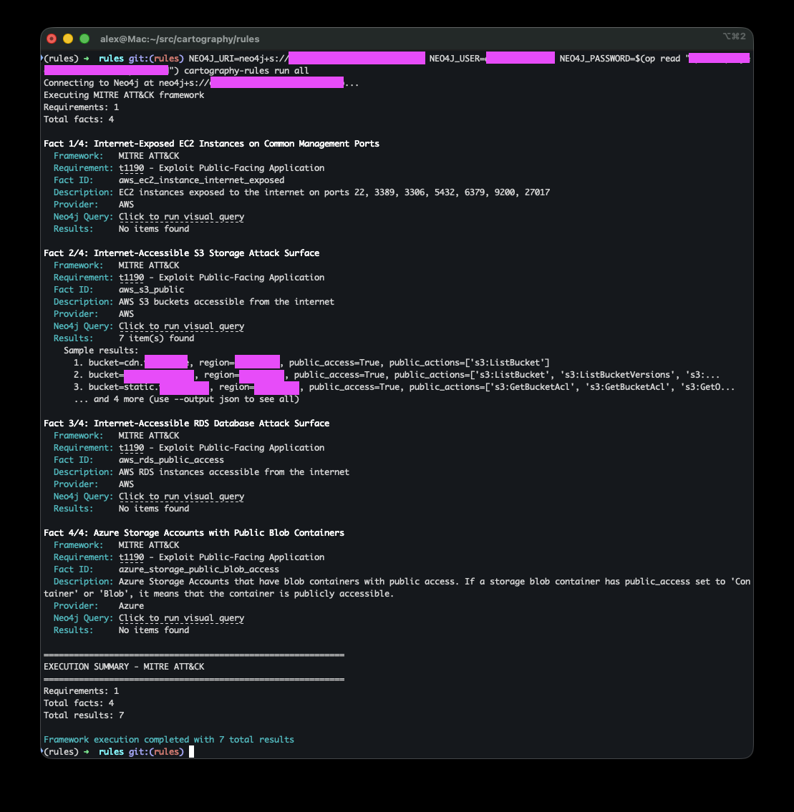
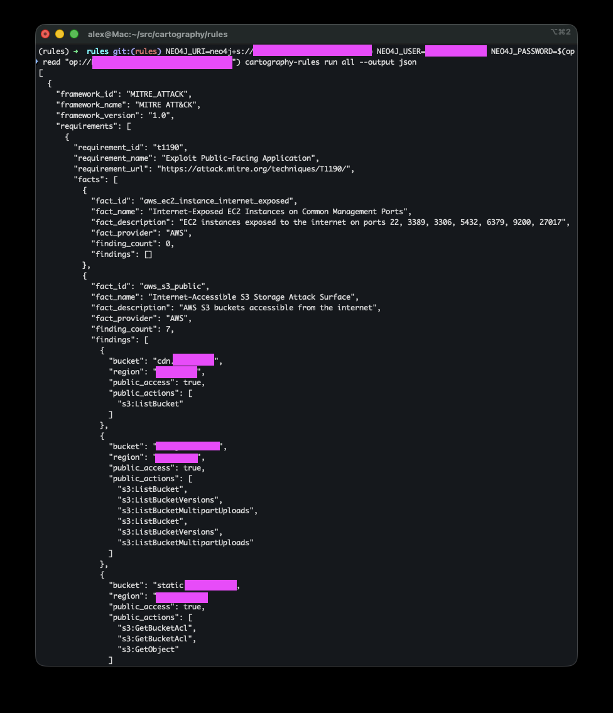

# Cartography Rules

You can use the `cartography-runrules` command to evaluate your environment against security frameworks.

## What are rules in Cartography?

Cartography ingests data from your environment and stores it in a knowledge graph. With `cartography-runrules`, we provide a set of pre-defined queries that let you evaluate your environment against common security frameworks, along with community-curated rules.


## Our opinionated approach

These rules are designed from an attacker’s perspective. For each framework technique, we ask: "What does an attacker actually need to execute this technique?"

Our queries surface opportunities that enable attacks at all stages of the kill chain—initial access, lateral movement, data exfiltration, and beyond.

**What we don’t do**: impose thresholds or arbitrary expectations.
Every organization has different risk tolerances. Saying “you should have at most 5 admin roles” is overly simplistic and rarely useful.

Instead, we focus on providing _facts_ and context so you can make your own informed decisions about your environment.
- If a query returns no results, you’ve successfully eliminated obvious attack opportunities for that technique.
- If it does return findings, you now have a clear list of potential targets for attackers.


## Why do it this way

Security teams already face too many competing priorities. Our goal is to highlight only the facts that represent meaningful risks.

For example:
An EC2 security group that allows inbound internet traffic is only relevant if there are compute instances actually attached to it. Otherwise, it’s noise.

## Setup

```bash
export NEO4J_URI=bolt://localhost:7687 # or your Neo4j URI
export NEO4J_USER=neo4j # or your username
export NEO4J_DATABASE=neo4j

set +o history # avoid storing the password in the shell history; can also use something like 1password CLI.
export NEO4J_PASSWORD=password
set -o history # turn shell history back on
```

## Usage

See available frameworks and facts
```bash
cartography-runrules list
```

Run a specific framework
```bash
cartography-runrules mitre-attack
```

Run all frameworks
```bash
cartography-runrules all
```



Run a specific framework and output as JSON
```bash
cartography-runrules mitre-attack --output json
```


Just in case you didn't know, you can also prefix the `cartography-runrules` command with environment variables like this:

```bash
NEO4J_URI=bolt://localhost:7687 NEO4J_USER=neo4j NEO4J_PASSWORD=password NEO4J_DATABASE=neo4j cartography-runrules all
```

This way it's all a one-liner.
